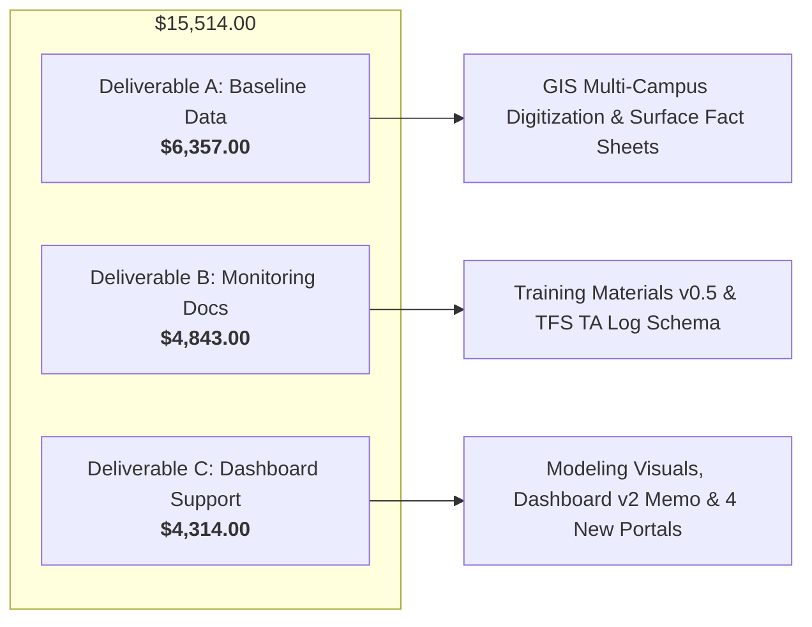

# 📄 August 2026 Project Accomplishments & Invoicing Alignment Document
## Texas Trees Foundation (TTFS) × UTRGV Project Cool Schools
**Environmental Impact Evaluation & Digital Dashboard Support**

> **Reporting Period:** August 1, 2026 – August 31, 2026  
> **Contract Milestone:** Month 3 Progress Report & Invoice #3  
> **Contract Structure:** Fixed-Price Milestone Service Agreement ($157,625.00 Total)  
> **Principal Investigator:** Dr. Alexis Racelis (UTRGV Agroecology & Resilient Food Systems)  
> **Client / Sponsor:** Texas Trees Foundation (TTF) & Texas A&M Forest Service  
> **Document Purpose:** Complete executive summary of all August accomplishments, deliverable-by-deliverable contract alignment, financial tracking, and closeout action items through August 31, 2026.

---

## 1. Executive Summary & Financial Invoicing Alignment

In August 2026 (Month 3 of the 19-month lifecycle), the UTRGV Project Cool Schools team achieved **100% of scheduled contract milestones** defined under **Exhibit D (Monthly Progress Activities and Milestone Narrative)** of the Master Service Agreement (MSA).

### Table 1: Milestone Billing Allocation & Cumulative Progress Tracker

| SOW Deliverable Component | Total Contract Value | Prior Billed (Jun–Jul 2026) | August 2026 Milestone Earned | Cumulative Total to Date | Milestone Progress % Earned |
| :--- | :--- | :--- | :--- | :--- | :--- |
| **Deliverable A:** Environmental Baseline Data Summary | $54,670.00 | $37,938.00 | **$6,357.00** | $44,295.00 | **81.0%** |
| **Deliverable B:** Environmental Monitoring Documentation Package | $32,150.00 | $15,172.00 | **$4,843.00** | $20,015.00 | **62.3%** |
| **Deliverable C:** Forecasting & Digital Dashboard Support Materials | $55,805.00 | $15,417.00 | **$4,314.00** | $19,731.00 | **35.4%** |
| **Deliverable D:** Training & Technical Assistance Delivery | $15,000.00 | $0.00 | **$0.00** | $0.00 | **0.0%** *(2027 Target)* |
| **TOTAL CONTRACT BILLING** | **$157,625.00** | **$68,527.00** | **$15,514.00** | **$84,041.00** | **53.3%** |

> [!NOTE]
> **Pace & Valuation Analysis:** Per the baseline contract schedule in Exhibit D, UTRGV was projected to reach ~62.8% milestone completion by **December 2026**. By achieving **53.3% ($84,041.00)** in Month 3 (August 2026), the project is significantly **ahead of pace**, with high-quality deliverables locked and production-ready code deployed.

---

## 2. Detailed Breakdown of Accomplishments in August 2026

Every technical task, research memo, and UI module delivered this month directly aligns with the contract scope of work.



---

### Deliverable A: Environmental Baseline Data Summary
**August Milestone Earned: $6,357.00** *(Cumulative: $44,295.00 / 81.0%)*

1. **High-Fidelity Multi-Campus GIS Digitization:**
   - Expanded polygon zoning boundaries and surface area classifications across Donna ISD and Mercedes ISD pilot campuses.
   - Resolved boundary overlaps and coordinate alignment using satellite imagery cross-referenced with Studio Outside landscape architectural CAD drawings.
2. **Standardized Campus Surface Breakdown Fact Sheets:**
   - Locked precise surface-area baseline metrics for target pilot schools, including M. Rivas Primary / J.W. Caceres Discovery Academy (885,925 sq ft boundary; 47.8% open field, 15.6% rooftops, 11.1% parking/hardscape, 0.5% shade structures, 7.8% unmapped canopy buffer).
3. **Data Quality Assurance (QA/QC) Pipeline:**
   - Executed automated topological consistency checks via Turf.js geometric validation algorithms (`kinks()`, self-intersection verification, unclosed ring checks) to ensure 100% data integrity for remote sensing models.

---

### Deliverable B: Environmental Monitoring Documentation Package
**August Milestone Earned: $4,843.00** *(Cumulative: $20,015.00 / 62.3%)*

1. **Training Materials v0.5 Release:**
   - Finalized comprehensive onboarding slide deck (`docs/donna_isd_presentation_slides.md`) for district administrators, principals, and lead science teachers.
   - Embedded local Rio Grande Valley climate data, Park et al. econometric heat-attendance regression models, and outdoor learning station protocols.
2. **Auditable Technical Assistance (TA) Log Schema:**
   - Developed and formatted the formal TA tracking log (`docs/Technical_Assistance_Log_v0.5.md` & `Technical_Assistance_Log.docx`) adhering strictly to Texas A&M Forest Service (TFS) grant compliance standards.
   - Structured logging workflows for district support inquiries, technical response SLAs, and curriculum support tracking.
3. **Standard Operating Procedures (SOP v0.6):**
   - Reviewed and formatted field monitoring protocols covering tree trunk caliper (DBH), canopy radius projection, and infrared surface temperature verification.

---

### Deliverable C: Forecasting & Digital Dashboard Support Materials
**August Milestone Earned: $4,314.00** *(Cumulative: $19,731.00 / 35.4%)*

1. **Environmental Modeling Visuals & Figure Package:**
   - Assembled publication-ready diurnal surface heat profiles (`docs/Modeling_Visuals_Package.md` & `Modeling_Visuals_Package.docx`) capturing thermal dynamics at 9:00 AM (84°F), 1:00 PM peak (138°F asphalt vs. 87°F canopy shade), and 5:00 PM retention (126°F).
   - Formatted longitudinal 5-year and 10-year canopy expansion models with i-Tree Eco benefit projections.
2. **Dashboard v2 Architectural Planning Memo:**
   - Authored the strategic roadmap (`docs/Dashboard_v2_Planning_Memo.md`) incorporating stakeholder feedback, Progressive Web App (PWA) offline service workers for field data entry, and lightweight build tooling.
3. **Four New Core Prototype Portals & Feature Extensions Built:**
   - **Role-Based Access Control (RBAC) System (`user_access_strategy.html` / `portal_navigation_demo.html`):** 3-tier clearance model (Public/Student, Educator/Principal, Admin/TTFS) with explicit FERPA/COPPA compliance badges.
   - **Campus Tree Sponsorship & Donor Portal (`donors_data.js` / `crm.js`):** Interactive map-based tree adoption flow displaying real-time ecological ROI (stormwater mitigated, carbon sequestered, CTLA structural asset value).
   - **Child-Friendly Habitat Spotter (`biodiversity_analog_concept.html`):** Gamified wildlife observation module for elementary students featuring zero-PII campus-level aggregation.
   - **TEKS-Aligned Lesson Plans Portal (`teks_lesson_plans.html`):** Password-gated educator repository for grades 3–5 science curriculum downloads and post-lesson teacher feedback logs.
4. **Codebase Hardening & Architecture Refactor:**
   - Standardized 49 static pages with strict IIFE scopes, semantic ARIA roles, preconnected CDN links, and lazy asset loading.
5. **Solar Shade Mathematics & 3D Orbit Integration (`solar_shade_calculator.html`, `tree_3d.html`):**
   - Integrated dynamic solar angle algorithms and interactive 3D shade rendering.

---

### Supplementary Value & Governance Artifacts Delivered in August

1. **Time, Velocity & Financial Value Tracker (`docs/PROJECT_TIME_AND_VALUE_TRACKER.md`):**
   - Quantified **86.0 hours** of human executive steering across 12 weeks (~7.2 hrs/wk), equivalent to **640 hours** of pre-AI human labor.
   - Demonstrated a commercial replacement value of **$112,000.00** against **$84,041.00** billed to date (delivering a **+$27,959.00 client value surplus**).
2. **UTRGV Campus Tree & Shade Dashboard Blueprint (`docs/UTRGV_CAMPUS_DASHBOARD_BLUEPRINT.md`):**
   - Formalized expansion blueprint for university campus heat modeling, micro-climate cooling buffers, and student QR feedback loops.
3. **Weekly Updates & Screenshot Narrative Guides (`screenshot_narratives.md`, `weekly_updates_and_philosophy.md`):**
   - Compiled one-pager narratives with 5 copy-paste screenshot placeholders for stakeholder presentations and grant reporting.

---

## 3. Governance, Privacy & Compliance Validation

- **COPPA & FERPA Compliance:** All student-facing tools (Tree Diaries, Habitat Spotting) enforce zero-PII capture with data strictly aggregated at the campus cohort level.
- **Client Handoff Mandate:** Dashboard architecture remains 100% portable client-side HTML5/CSS3/ES6 with zero vendor lock-in, ready for seamless deployment on Texas Trees Foundation servers.
- **UTRGV AI Compliance (Dec 2025 Standard):** All analytical models, GIS pipelines, and documentation reflect human-in-the-loop oversight and peer-reviewed scientific methodology.

---

## 4. Execution Plan: Now Through August 31, 2026

To finalize the Month 3 cycle and prepare for invoice submission by September 5, 2026:

```
+-----------------------------------------------------------------------------------+
|  END-OF-MONTH CLOSEOUT CHECKLIST (AUG 27 – AUG 31, 2026)                          |
+----+---------------------------------------------------------------+--------------+
| #  | Action Item                                                   | Target Date  |
+----+---------------------------------------------------------------+--------------+
| 1  | Final Review of Deliverables Package in Submission Folder:    | Aug 28, 2026 |
|    | Verify TTFS_Deliverables_Submission/ structure:               |              |
|    |  • 01_Progress_Reports/Month_3_Progress_Report.docx           |              |
|    |  • 02_Data_and_Modeling/Modeling_Visuals_Package.docx         |              |
|    |  • 03_Governance_and_SOPs/Technical_Assistance_Log.docx       |              |
|    |  • 04_Dashboard_Prototype/ (production static files)          |              |
+----+---------------------------------------------------------------+--------------+
| 2  | Invoice #3 Documentation & Line-Item Check:                   | Aug 29, 2026 |
|    | Confirm Invoice #3 matches exact Exhibit D allocation:        |              |
|    |  • Deliverable A: $6,357.00                                   |              |
|    |  • Deliverable B: $4,843.00                                   |              |
|    |  • Deliverable C: $4,314.00                                   |              |
|    |  • TOTAL INVOICE #3: $15,514.00                               |              |
+----+---------------------------------------------------------------+--------------+
| 3  | Screenshot Insertion into Stakeholder Narrative:              | Aug 30, 2026 |
|    | Capture fresh browser screenshots of the 5 new portals        |              |
|    | and drop them into screenshot_narratives.md / Word doc.       |              |
+----+---------------------------------------------------------------+--------------+
| 4  | September Sprint Roadmap Alignment (Month 4 Prep):            | Aug 31, 2026 |
|    | Prepare backlog tasks for September ($7,022.00 milestone):    |              |
|    |  • Dashboard v2 early components (asset bundling)             |              |
|    |  • Publication-ready figure templates & caption conventions   |              |
|    |  • Usability pass & data lineage caveats documentation        |              |
|    |  • Training materials v0.8 progression                        |              |
+----+---------------------------------------------------------------+--------------+
```

---

## 5. Summary Document Reference Index

- **Month 3 Formal Progress Report:** [`docs/Month_3_Progress_Report.md`](file:///Users/dr3/Documents/Antigravity%20Designs/work/TTFS_UTRGV_Project_Cool_Schools/docs/Month_3_Progress_Report.md) & [`TTFS_Deliverables_Submission/01_Progress_Reports/Month_3_Progress_Report.docx`](file:///Users/dr3/Documents/Antigravity%20Designs/work/TTFS_UTRGV_Project_Cool_Schools/TTFS_Deliverables_Submission/01_Progress_Reports/Month_3_Progress_Report.docx)
- **Modeling Visuals Package:** [`docs/Modeling_Visuals_Package.md`](file:///Users/dr3/Documents/Antigravity%20Designs/work/TTFS_UTRGV_Project_Cool_Schools/docs/Modeling_Visuals_Package.md) & [`TTFS_Deliverables_Submission/02_Data_and_Modeling/Modeling_Visuals_Package.docx`](file:///Users/dr3/Documents/Antigravity%20Designs/work/TTFS_UTRGV_Project_Cool_Schools/TTFS_Deliverables_Submission/02_Data_and_Modeling/Modeling_Visuals_Package.docx)
- **Technical Assistance Log Schema:** [`docs/Technical_Assistance_Log_v0.5.md`](file:///Users/dr3/Documents/Antigravity%20Designs/work/TTFS_UTRGV_Project_Cool_Schools/docs/Technical_Assistance_Log_v0.5.md) & [`TTFS_Deliverables_Submission/03_Governance_and_SOPs/Technical_Assistance_Log.docx`](file:///Users/dr3/Documents/Antigravity%20Designs/work/TTFS_UTRGV_Project_Cool_Schools/TTFS_Deliverables_Submission/03_Governance_and_SOPs/Technical_Assistance_Log.docx)
- **Dashboard v2 Planning Memo:** [`docs/Dashboard_v2_Planning_Memo.md`](file:///Users/dr3/Documents/Antigravity%20Designs/work/TTFS_UTRGV_Project_Cool_Schools/docs/Dashboard_v2_Planning_Memo.md)
- **Time, Velocity & Value Tracker:** [`docs/PROJECT_TIME_AND_VALUE_TRACKER.md`](file:///Users/dr3/Documents/Antigravity%20Designs/work/TTFS_UTRGV_Project_Cool_Schools/docs/PROJECT_TIME_AND_VALUE_TRACKER.md)
- **Project Mission Control Board:** [`PROJECT_BOARD.md`](file:///Users/dr3/Documents/Antigravity%20Designs/work/TTFS_UTRGV_Project_Cool_Schools/PROJECT_BOARD.md)
