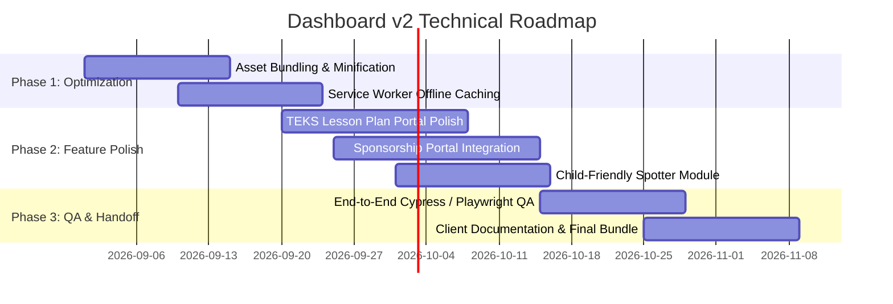

# 🚀 Dashboard v2 Architectural & Feature Planning Memo

> **Contract Deliverable:** SOW Deliverable C — Forecasting & Digital Dashboard Support Materials (August 2026 Milestone)  
> **Prepared for:** Texas Trees Foundation & UTRGV Project Cool Schools  
> **Target Release:** Dashboard v2 Release (Fall 2026 / Q4 Sprint)  
> **Authors:** UTRGV GIS & Engineering Team  

---

## 1. Executive Summary

This memo outlines the architectural and functional roadmap for **Dashboard v2**, synthesizing feedback from internal UTRGV/TTFS testing and early stakeholder reviews across Donna ISD and Mercedes ISD. 

Dashboard v1 successfully proved the viability of high-fidelity campus polygon digitizing, modular D3/Chart.js physics models, and multi-campus environmental ledger calculations across 49 interactive static pages. 

**Dashboard v2 focuses on four strategic pillars:**
1. **Performance & Field Usability:** Offline Service Worker caching and lightweight asset bundling for field survey use on tablets.
2. **Pedagogical Integration:** Password-protected, TEKS-aligned curriculum modules for elementary teachers.
3. **Community & Stewardship Portals:** Campus tree sponsorship workflows and kid-friendly wildlife/habitat tracking.
4. **Governance & Multi-Tier Access:** Role-Based Access Control (RBAC) ensuring FERPA/COPPA compliance and clean handoff to TTFS IT infrastructure.

---

## 2. Synthesis of Dashboard v1 Feedback

```
+-----------------------------------------------------------------------------------+
|  SYNTHESIS OF V1 FEEDBACK -> V2 ARCHITECTURAL RESOLUTIONS                         |
+--------------------------+--------------------------------------------------------+
|  Stakeholder Feedback    |  v2 Architectural / Feature Resolution                 |
+--------------------------+--------------------------------------------------------+
|  "Cell reception is weak |  Implement PWA Service Worker caching for core CDNs    |
|   at outdoor campus      |  and map tiles to support full offline field surveys.  |
|   perimeters."           |                                                        |
+--------------------------+--------------------------------------------------------+
|  "Teachers need specific |  Build dedicated TEKS-aligned Lesson Plan portal with  |
|   grades 3-5 curriculum  |  downloadable PDF guides and outdoor lab checklists.  |
|   connections."          |                                                        |
+--------------------------+--------------------------------------------------------+
|  "Elementary students    |  Deploy the simplified 'Habitat Spotter' and 'Tree     |
|   find D3 physics graphs |  Diary' analog interfaces (visual badges, zero jargon).|
|   too complex."          |                                                        |
+--------------------------+--------------------------------------------------------+
|  "Donors and PTAs want   |  Introduce the Campus Tree Sponsorship Portal with     |
|   tangible ROI on tree   |  live environmental ROI calculators ($ saved/year).    |
|   investments."          |                                                        |
+--------------------------+--------------------------------------------------------+
|  "Data must easily hand  |  Retain 100% static, client-side HTML5/CSS3/ES6        |
|   off to TTFS servers."  |  architecture with zero vendor lock-in or databases.   |
+--------------------------+--------------------------------------------------------+
```

---

## 3. Core v2 Module Specifications

### Module 2.1: Role-Based Access Control & User Strategy (`user_access_strategy.html`)
* **Objective:** Segregate public educational views from district-level administrative dashboards and research configurations.
* **Access Tiers:**
  1. *Public / Student Tier:* Open access to interactive campus maps, tree species explorers, and simplified habitat logs. (Zero login required).
  2. *Educator Tier (Protected):* Access to printable TEKS lesson plans, outdoor safety rubrics, and aggregated student activity forms.
  3. *Administrator / TTFS Tier:* Full access to polygon digitization tools, cost models, maintenance logs, and raw GeoJSON exports.

### Module 2.2: TEKS-Aligned Lesson Plan Portal (`teks_lesson_plans.html`)
* **Curriculum Links:** Texas Essential Knowledge and Skills (TEKS) for Science (Grades 3, 4, and 5).
  * *TEKS 3.9A / 4.9A / 5.9A:* Organisms and environments, microclimate observation, thermal energy transfer.
* **Teacher Toolkit:** Pre-built 45-minute lesson plans integrating infrared temperature measurement, canopy radius calculation, and wildlife spotting.

### Module 2.3: Child-Friendly Biodiversity Spotting (`biodiversity_analog_concept.html`)
* **Pedagogical Design:** High-contrast, card-based spotting logs replacing dense scientific tables.
* **COPPA Compliance:** Observations are aggregated at the campus level. No student names, timestamps, or student photos are captured.

### Module 2.4: Campus Tree Sponsorship & Living Legacy (`crm.js` / `donors_data.js`)
* **Functionality:** Interactive donor portal allowing community supporters and alumni to sponsor trees on specific school campuses.
* **Metrics Displayed:** Directly ties donor contributions to tangible ecological returns (gallons of stormwater absorbed, pounds of CO2 sequestered, and square footage of shade created).

---

## 4. Technical Roadmap & Performance Goals (Fall 2026)



### Key Performance Targets
* **First Contentful Paint (FCP):** < 1.0s across all mobile and desktop viewports.
* **Lighthouse Score:** 95+ in Performance, Accessibility, Best Practices, and SEO.
* **Offline Readiness:** 100% of campus maps, species profiles, and field forms accessible without an internet connection.

---

## 5. Client Handoff & Governance Assurance

To fulfill the **Handoff Mandate**, Dashboard v2 will be delivered as a zero-dependency static build package containing:
1. Static HTML/CSS/JS assets ready for immediate hosting on any standard web server (Apache, Nginx, GitHub Pages, or Netlify).
2. Clean documented data ingestion pipelines for updating campus GeoJSON boundaries and tree inventories via standard CSV uploads.
3. Updated `governance_and_compliance.md` and standard operating manuals for TTF technical staff.
