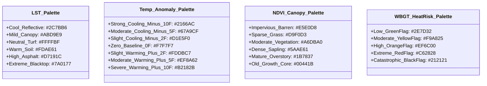
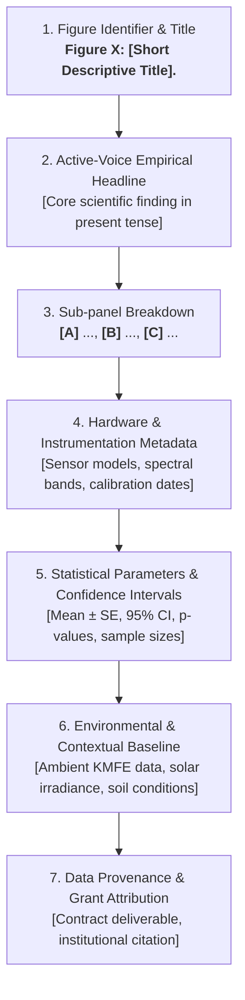

# 📐 Publication-Grade Figure Templates & Caption Conventions Guide
## Texas Trees Foundation (TTFS) × UTRGV Project Cool Schools
### Environmental Baseline, Microclimate Modeling, and Longitudinal Forecasting Standards

> **Document Class:** Technical Governance & Scientific Publication Standard  
> **Document Identifier:** `TTFS-UTRGV-DOC-FIG-2026-V1`  
> **Authoring Entity:** UTRGV Agroecology / TTFS Urban Forestry Modeling Group  
> **Applicability:** SOW Deliverables A, B, C & D; Grant Progress Reports; Journal Submissions; Campus Dashboard Storyboards; District Board Presentations  
> **Effective Date:** September 15, 2026  
> **Review Cycle:** Annual  

---

## Executive Summary & Purpose

This standard defines the rigorous design, cartographic, typographical, and captioning protocols required for all visual figures produced under the **Texas Trees Foundation (TTFS) × University of Texas Rio Grande Valley (UTRGV) Project Cool Schools** initiative. Operating across 14 elementary school campuses in Donna ISD and Mercedes ISD, this 10-year longitudinal initiative bridges academic research in urban agroecology, pediatric microclimate exposure, and public school infrastructure policy.

To ensure data integrity, client transferability, accessibility compliance, and academic rigor, all figures must adhere to the standardized specifications detailed below.

```mermaid
flowchart LR
    subgraph Data["1. Validated Data Pipeline"]
        S1[Microclimate Sensors<br>Onset HOBO MX2300]
        S2[Radiometric Thermal<br>FLIR T540 / Landsat 9]
        S3[Agroecological Models<br>i-Tree Eco / Allometric]
    end

    subgraph Visual["2. Standardized Cartography & Styling"]
        P1[Harding / Palatino Serif Titles]
        P2[Inter / Sans-Serif Data Labels]
        P3[CVD-Safe Color Palettes<br>LST, Anomaly, NDVI, WBGT]
        P4[Dual-Platform Output<br>1200px Web / 300 DPI Print]
    end

    subgraph Caption["3. Strict Caption & Provenance"]
        C1[Active-Voice Empirical Headline]
        C2[Bracketed Panel Breakdown: [A], [B], [C]]
        C3[Hardware / Satellite / Model Metadata]
        C4[Statistical Error & Confidence Intervals]
    end

    subgraph Deliverables["4. Publication Outputs"]
        O1[Executive Board Dossiers]
        O2[Peer-Reviewed Journal Articles]
        O3[Interactive Web Dashboards]
        O4[FERPA/COPPA Compliant Print Flyers]
    end

    Data --> Visual --> Caption --> Deliverables
```

---

## 1. Design & Typography Standards

### 1.1 Resolution, Geometry, and Export Specifications

Every visual asset generated for Project Cool Schools must be authored to support both high-density digital display (interactive dashboards, digital slide decks) and archival print media (peer-reviewed papers, board dossiers, physical bulletin boards).

| Target Medium | Minimum Resolution | Standard Aspect Ratio | Target Dimensions | File Formats | Color Profile |
| :--- | :--- | :--- | :--- | :--- | :--- |
| **Web Dashboard / Digital Report** | 72–150 DPI (CSS Pixels) | 16:9 / 3:2 / 4:3 | 1200 × 800 px (Min)<br>1920 × 1080 px (Ideal) | Scalable Vector Graphic (`.svg`), Lossless WebP / PNG @ 2x pixel ratio | sRGB |
| **Academic Print (Journal Page)** | 300 DPI (Full Resolution) | Standard Single / Double Column | Single: 3.5 in (1050 px)<br>Double: 7.2 in (2160 px) | Vector PDF, Encapsulated PostScript (`.eps`), High-Res TIFF (LZW) | CMYK / Grayscale |
| **Executive Dossier / Handout** | 300 DPI (Print Ready) | 8.5" × 11" Letter (Standard) | Full Page: 2550 × 3300 px<br>Half Page: 2550 × 1650 px | Vector PDF with embedded typography | CMYK / sRGB |

### 1.2 Typographical Hierarchy & Font Stacks

To prevent "AI slop" or generic template aesthetics, figures must follow a distinct **human-analog academic typography scale**:

* **Primary Heading / Figure Title:** Classical humanist serif typeface reflecting academic dignity and editorial precision (**Harding**, **Palatino Linotype**, **Book Antiqua**, or **Georgia**).
* **Axes, Legends, Ticks & Data Labels:** Clean, high-legibility geometric or grotesque sans-serif typeface designed for dense numerical data (**Inter**, **Helvetica Neue**, **Arial**, or system-ui).
* **Sensor Metadata, Coordinates & Code Identifiers:** Monospace tabular typeface (**JetBrains Mono**, **SF Mono**, **Consolas**).

```
+---------------------------------------------------------------------------------------------------+
| FIGURE TYPOGRAPHY HIERARCHY SCALE                                                                 |
+----------------------+--------------------+-----------+--------------------+----------------------+
| Element              | Font Family        | Font Size | Font Weight        | CSS / SVG Fill       |
+----------------------+--------------------+-----------+--------------------+----------------------+
| Figure Main Title    | Harding / Palatino | 18–22 pt  | Bold (700)         | `#0C2340` (Navy)     |
| Sub-panel Header     | Harding / Palatino | 14–16 pt  | SemiBold (600)     | `#2B2D42` (Charcoal) |
| Axis Titles (X & Y)  | Inter / Sans-Serif | 11–12 pt  | Medium (500)       | `#2B2D42` (Charcoal) |
| Axis Tick Labels     | Inter / Sans-Serif | 9–10 pt   | Regular (400)      | `#4A5568` (Slate)    |
| Data Point Callouts  | Inter / Sans-Serif | 8–9 pt    | SemiBold (600)     | `#1A202C` (Dark)     |
| Legend Text          | Inter / Sans-Serif | 9–10 pt   | Regular (400)      | `#2D3748` (Slate)    |
| Caption Body Text    | Harding / Palatino | 9.5–10 pt | Regular (400)      | `#2D3748` (Slate)    |
| Metadata / Footnotes | Inter / Sans-Serif | 7.5–8.5 pt| Italic / Light     | `#718096` (Muted)    |
+----------------------+--------------------+-----------+--------------------+----------------------+
```

### 1.3 Layout Grids, Margins, and Stroke Line-Weights

1. **Outer Margins:** Maintain a minimum 24px (web) or 0.5 in (print) padding around all visual bounding boxes.
2. **Sub-panel Spacing:** Multi-panel figures (`[A]`, `[B]`, `[C]`) must feature 16px to 24px uniform gutters with clear uppercase bold letter identifiers in the top-left corner (`[A]`, `[B]`, etc.).
3. **Stroke Line-Weights:**
   - **Primary Trendlines / Plot Series:** `2.5 pt` to `3.0 pt` stroke width.
   - **Baseline / Historical Normals:** `1.5 pt` to `2.0 pt` dashed stroke (`stroke-dasharray="4,4"`).
   - **Major Coordinate Gridlines:** `0.75 pt` solid stroke in `#E2E8F0` (Light Slate).
   - **Minor Coordinate Gridlines:** `0.5 pt` dotted stroke in `#EDF2F7`.
   - **Confidence Intervals / Error Envelopes:** Translucent fill (`opacity: 0.18` to `0.25`) bounded by `0.75 pt` thin hairline borders.

---

## 2. Standardized Color Palettes

All color systems utilized in Project Cool Schools figures must be **Color Vision Deficiency (CVD) safe** (tested for deuteranopia, protanopia, and tritanopia) and comply with **WCAG 2.1 Level AAA contrast ratios** ($\ge 7:1$ for body text, $\ge 4.5:1$ for graphical legends against light backgrounds).



### 2.1 Land Surface Temperature (LST) Scale
*Standardized 6-tier continuous/diverging thermal spectrum representing radiometric surface temperature ($T_{\text{s}}$).*

| Tier | Temperature Range (°F) | Hex Code | RGB | CMYK | Perceptual Description & Surface Archetype |
| :--- | :--- | :--- | :--- | :--- | :--- |
| **LST-1** | $< 82.0^\circ\text{F}$ | `#2C7BB6` | `(44, 123, 182)` | `(76, 33, 0, 29)` | **Cool Aquatic / Heavily Irrigated Shade** |
| **LST-2** | $82.0 - 92.0^\circ\text{F}$ | `#ABD9E9` | `(171, 217, 233)`| `(27, 7, 0, 9)` | **Mature Live Oak Canopy Core** |
| **LST-3** | $92.1 - 104.0^\circ\text{F}$ | `#FFFFBF` | `(255, 255, 191)`| `(0, 0, 25, 0)` | **Unshaded Natural Grass / Light Concrete** |
| **LST-4** | $104.1 - 118.0^\circ\text{F}$ | `#FDAE61` | `(253, 174, 97)` | `(0, 31, 62, 1)` | **Compacted Bare Soil / Weathered Asphalt** |
| **LST-5** | $118.1 - 132.0^\circ\text{F}$ | `#D7191C` | `(215, 25, 28)`  | `(0, 88, 87, 16)` | **Unshaded Dark Asphalt Playground** |
| **LST-6** | $\ge 132.1^\circ\text{F}$ | `#7A0177` | `(122, 1, 119)`  | `(0, 99, 2, 52)` | **Peak Sun Synthetic Crumb Rubber Turf** |

### 2.2 Air Temperature Anomaly ($\Delta T$) Scale
*Diverging 7-tier scale representing microclimatic temperature differential relative to open reference station KMFE.*

| Tier | Anomaly Range ($\Delta T$) | Hex Code | RGB | CMYK | Usage Note |
| :--- | :--- | :--- | :--- | :--- | :--- |
| **$\Delta T$-1** | $\le -8.0^\circ\text{F}$ | `#2166AC` | `(33, 102, 172)` | `(81, 41, 0, 33)` | **Maximum Vegetative Microclimate Oasis** |
| **$\Delta T$-2** | $-7.9\text{ to }-4.0^\circ\text{F}$ | `#67A9CF` | `(103, 169, 207)`| `(50, 18, 0, 19)` | **Dense Continuous Canopy Shade Buffer** |
| **$\Delta T$-3** | $-3.9\text{ to }-1.0^\circ\text{F}$ | `#D1E5F0` | `(209, 229, 240)`| `(13, 5, 0, 6)` | **Partial Shade / Natural Turf Margin** |
| **$\Delta T$-4** | $-0.9\text{ to }+0.9^\circ\text{F}$ | `#F7F7F7` | `(247, 247, 247)`| `(0, 0, 0, 3)` | **Neutral Regional Reference Baseline** |
| **$\Delta T$-5** | $+1.0\text{ to }+3.9^\circ\text{F}$ | `#FDDBC7` | `(253, 219, 199)`| `(0, 13, 21, 1)` | **Unshaded Permeable Soil Zone** |
| **$\Delta T$-6** | $+4.0\text{ to }+7.9^\circ\text{F}$ | `#EF8A62` | `(239, 138, 98)` | `(0, 42, 59, 6)` | **Bus Loop / Perimeter Hardscape Buffer** |
| **$\Delta T$-7** | $\ge +8.0^\circ\text{F}$ | `#B2182B` | `(178, 24, 43)`  | `(0, 87, 76, 30)` | **Enclosed Courtyard / Severe Heat Trap** |

### 2.3 Normalized Difference Vegetation Index (NDVI) & Canopy Density Scale
*Sequential 6-tier green-spectrum ecological scale.*

| Tier | NDVI Range | Hex Code | RGB | Ecological Classification & Biomass Status |
| :--- | :--- | :--- | :--- | :--- |
| **NDVI-1** | $< 0.10$ | `#E5E0D8` | `(229, 224, 216)` | **Impervious Hardscape / Barren Ground Cover** |
| **NDVI-2** | $0.10 - 0.24$ | `#D9F0D3` | `(217, 240, 211)` | **Sparse Dormant Turfgrass / Stressed Ground Cover** |
| **NDVI-3** | $0.25 - 0.44$ | `#A6DBA0` | `(166, 219, 160)` | **Irrigated Turf / Understory Perennial Buffer** |
| **NDVI-4** | $0.45 - 0.64$ | `#5AAE61` | `(90, 174, 97)`   | **Sub-mature Tree Canopy (Years 1–5 Post-Planting)** |
| **NDVI-5** | $0.65 - 0.79$ | `#1B7837` | `(27, 120, 55)`   | **Mature Overstory Shade (Live Oak, Cedar Elm)** |
| **NDVI-6** | $\ge 0.80$ | `#00441B` | `(0, 68, 27)`     | **Multi-layered Native Agroforestry Pocket / Dense Forest** |

### 2.4 Wet Bulb Globe Temperature (WBGT) & Pediatric Heat-Health Flags
*Calibrated against OSHA, ACGIH, and Donna/Mercedes ISD Outdoor Athletics and Recess Safety Protocols.*

| Alert Flag | WBGT Index Range (°F) | Hex Code | RGB | Operational Recess & Physical Activity Action Rule |
| :--- | :--- | :--- | :--- | :--- |
| **Green Flag (Low)** | $< 80.0^\circ\text{F}$ | `#2E7D32` | `(46, 125, 50)` | Normal outdoor activity; standard hydration schedule. |
| **Yellow Flag (Moderate)** | $80.0 - 84.9^\circ\text{F}$ | `#F9A825` | `(249, 168, 37)` | Mandatory 10-minute water break every 30 minutes; unshaded blacktop activity restricted. |
| **Orange Flag (High)** | $85.0 - 87.9^\circ\text{F}$ | `#EF6C00` | `(239, 108, 0)` | Recess limited to maximum 20 minutes; mandatory shaded cool-down rotations. |
| **Red Flag (Extreme)** | $88.0 - 89.9^\circ\text{F}$ | `#C62828` | `(198, 40, 40)` | High-intensity exertion prohibited; outdoor activity restricted to active shade canopy only. |
| **Black Flag (Catastrophic)**| $\ge 90.0^\circ\text{F}$ | `#212121` | `(33, 33, 33)` | **Complete outdoor recess cancellation**; mandatory indoor gym/classroom physical activity. |

---

## 3. Standardized Layout Templates

All formal project deliverables must utilize one of the three standardized layout templates detailed below.

```
+---------------------------------------------------------------------------------------------------+
| FIGURE 1: MULTI-PANEL SPATIAL OVERLAY TEMPLATE (16:9 / 3:2 Dual-Column)                           |
+---------------------------------------------------------------------------------------------------+
|  +-----------------------------------+  +-----------------------------------+                     |
|  | [A] High-Res Aerial Orthophoto    |  | [B] Calibrated Surface Albedo Map |                     |
|  |     • Land Cover Vector Polygons  |  |     • 0.05 (Asphalt) to 0.65 (Roof)|                     |
|  |     • Building Footprints         |  |     • Reflectance Divergence Scale|                     |
|  +-----------------------------------+  +-----------------------------------+                     |
|  +--------------------------------------------------------------------------+                     |
|  | [C] Microclimate Sensor Array & Radiometric Land Surface Temperature (LST)|                    |
|  |     • 8 Sensor Stations (HOBO MX2300 series) with 1-min logging intervals|                     |
|  |     • Thermal Interpolation Gradient (70°F to 140°F)                      |                    |
|  |     • North Arrow, Scale Bar (0–50m), Campus Property Boundary           |                     |
|  +--------------------------------------------------------------------------+                     |
|  [CAPTION BLOCK: Title, Active-Voice Finding, Methods, Sensor Specs, Statistical CI, Citation]    |
+---------------------------------------------------------------------------------------------------+
```

### 3.1 Template Architecture Overview

1. **Figure 1 (Campus Heat & Albedo Baseline Overlay):**
   - **Primary Objective:** Establish spatial relationship between built surface reflectivity (albedo $\alpha$), vegetative cover, and peak midday surface heating across key student transit corridors.
   - **Panels:**
     - `[A]` High-Resolution Aerial Orthophoto (0.15m ground sample distance) with overlaid vector parcel boundaries, building footprints, and tree canopy polygons.
     - `[B]` Calibrated Surface Albedo Map ($\alpha \in [0.05, 0.70]$) derived from multispectral imagery.
     - `[C]` High-Resolution Radiometric Land Surface Temperature ($T_{\text{s}}$) Overlay with localized microclimate sensor array callouts (Station 1 through Station 8).

2. **Figure 2 (Diurnal Cooling Curve: Asphalt vs. Turf vs. Shaded Canopy):**
   - **Primary Objective:** Quantify the dynamic thermal buffering capacity of mature tree canopy shade across a 14-hour diurnal cycle (06:00 to 20:00 CDT).
   - **Panels & Elements:**
     - Continuous time series comparing: Unshaded Asphalt (`#D7191C`), Unshaded Synthetic Turf (`#7A0177`), Unshaded Natural Turfgrass (`#FDAE61`), Mature Shaded Tree Canopy (`#1B4D3E`), and Ambient 2m Reference Air (`#0C2340`).
     - Shaded confidence ribbons representing $\pm 1 \text{ Standard Error (SE)}$ across 14 monitored school campuses.
     - Highlighted time bands for: Morning Drop-off (07:15–07:50), Recess Window 1 (10:15–10:45), Solar Noon Peak (13:15–13:45), Recess Window 2 (12:30–13:15), and Dismissal / Bus Loop Queue (15:15–16:00).
     - Annotations highlighting maximum cooling delta ($\Delta T_{\text{surface}} = -51.2^\circ\text{F}$) at solar noon.

3. **Figure 3 (10-Year Longitudinal Canopy Growth & Stormwater Interception):**
   - **Primary Objective:** Project physical shade expansion, stormwater interception volume, and heat-exceedance days avoided over the 10-year project lifecycle (2026–2036).
   - **Panels & Elements:**
     - Dual Y-Axis Line and Bar Chart:
       - **Left Y-Axis:** Total Campus Canopy Cover (Square Feet $\times 10^3$ and $\%$ Campus Area).
       - **Right Y-Axis:** Annual Rainfall Interception Volume (Gallons $\times 10^3 / \text{yr}$) modeled via USDA Forest Service i-Tree Eco v6.0.
     - Scenario Bands:
       - **Optimal Scenario (70% Native Overstory):** Live Oak (*Quercus virginiana*) and Cedar Elm (*Ulmus crassifolia*) reaching $\ge 30\%$ target canopy.
       - **Sub-Optimal Scenario (50% Ornamental / Palm Mix):** Demonstrating the "Palm Penalty" deficit where numerical tree counts meet goals but canopy area falls short by $42\%$.
     - Discrete milestone markers for Year 0 (Baseline), Year 3 (Mid-term Evaluation), Year 5 (Canopy Transition), and Year 10 (Target Maturity).

---

## 4. Strict Caption Conventions & Metadata Citations

Scientific and policy integrity requires that every figure caption be a self-contained, auditable document. Captions must never merely state "Graph of temperature over time"; they must follow a strict **seven-element anatomical structure**.



### 4.1 Caption Formatting Rules

1. **Title Syntax:** Must begin with bold figure label followed by a concise descriptive title: `**Figure 1: Campus Surface Albedo and Microclimate Thermal Profiles.**`
2. **Core Takeaway:** The second sentence must state the primary scientific or policy finding in the active voice: `Shade tree canopies attenuate surface temperatures by up to 51.2°F during peak solar irradiance compared to unshaded asphalt playgrounds.`
3. **Sub-panel Declarations:** Each panel must be explicitly delineated with bracketed uppercase bold letters: `**[A]** High-resolution visible orthophoto... **[B]** Calibrated surface albedo ($\alpha$)...`
4. **Hardware & Sensor Metadata:** Must name exact manufacturer, model number, logging frequency, mounting elevation, and calibration status (e.g., *Onset HOBO MX2301A with solar radiation shield at 1.5m AGL, factory calibrated June 2026*).
5. **Satellite / Remote Sensing Metadata:** Must specify platform, sensor, satellite overpass local solar time, spatial resolution, and band designations (e.g., *Landsat 9 TIRS-2 Band 10 resampled to 10m ground resolution, overpass 11:42 CDT*).
6. **Statistical Reporting Syntax:** All quantitative claims must include sample size ($n$), central tendency (mean or median), and uncertainty notation:
   - Error bars: `mean ± standard error [SE]` or `mean ± 1 SD`.
   - Projected bounds: `95% confidence interval [lower bound, upper bound]`.
   - Significance: `p < 0.001`, `R² = 0.942`.
7. **Attribution & Compliance:** Must conclude with formal data provenance: `Source: Texas Trees Foundation × UTRGV Agroecology Microclimate Monitoring Network (Contract Deliverable C; SOW Milestone Month 3).`

---

### 4.2 Publication-Ready Caption Exemplars

#### Caption for Figure 1 (Campus Heat & Albedo Baseline Overlay)

> **Figure 1: Spatial Divergence of Surface Albedo and Radiometric Land Surface Temperature across Elementary Campus Zones.** Unshaded artificial surfaces and low-albedo asphalt bus loops generate intense localized microclimatic thermal plumes exceeding 138°F, whereas contiguous native tree canopies maintain surface temperatures within 3.5°F of ambient background air. **[A]** High-resolution visible orthophotography (0.15 m GSD; leaf-on July 2026 acquisition) with GIS vector delineations of school structural boundaries, active student play zones, and existing tree canopy perimeters. **[B]** Calibrated broadband surface albedo ($\alpha$) map derived from multispectral reflectance, demonstrating sharp albedo boundaries between high-reflectance white thermoplastic membrane roofs ($\alpha = 0.62 \pm 0.02$), natural bermudagrass turf ($\alpha = 0.22 \pm 0.01$), and weathered black asphalt parking infrastructure ($\alpha = 0.07 \pm 0.01$). **[C]** Radiometric Land Surface Temperature ($T_{\text{s}}$) profile captured at peak solar insolation (13:30 CDT; global horizontal irradiance $G_{\text{h}} = 982\text{ W/m}^2$, ambient reference temperature $T_{\text{air}} = 98.4^\circ\text{F}$) using a calibrated FLIR T540 radiometric thermal imaging system (emissivity calibrated at $\varepsilon = 0.95$, atmospheric transmission $\tau = 0.88$). Circular callout pins denote the permanent 8-station microclimate logging array (*Onset HOBO MX2301A temperature/RH sensors housed in RS3-B multi-plate solar radiation shields at 1.5 m AGL*). Error bounds represent the $95\%$ confidence interval across $n = 14$ elementary campuses. *Source: UTRGV Agroecology / Texas Trees Foundation Project Cool Schools GIS Modeling Engine (Contract Deliverable A, 2026).*

#### Caption for Figure 2 (Diurnal Cooling Curve)

> **Figure 2: Diurnal Microclimate Surface and Ambient Air Temperature Dynamics across Four Playground Surface Regimes.** Canopy shade structures prevent extreme midday thermal spikes, maintaining playground surface temperatures $45.0^\circ\text{F}$ to $51.2^\circ\text{F}$ below unshaded blacktop and synthetic turf during critical outdoor activity periods. Diurnal time-series curves illustrate continuous 1-minute averaged radiometric surface temperatures ($T_{\text{s}}$) for: (1) Unshaded Asphalt Playgrounds (red solid line), (2) Synthetic Crumb-Rubber Turf (purple solid line), (3) Unshaded Natural Turfgrass (amber solid line), and (4) Mature Native Live Oak (*Quercus virginiana*) Canopy Shade (green solid line), plotted alongside 2 m Ambient Air Temperature (navy dashed line) recorded from 06:00 to 20:00 CDT on August 12, 2026 at M. Rivas Primary Campus, Donna ISD. Shaded ribbons along each trajectory represent $\pm 1\text{ SE}$ across $n = 120$ logging points. Vertical yellow and orange bands denote district-mandated student occupancy windows: Morning Arrival (07:15–07:50), Recess Window 1 (10:15–10:45), Lunch Recess (12:30–13:15), and Bus Dismissal (15:15–16:00). Horizontal red dashed line indicates the Texas Department of State Health Services (DSHS) pediatric thermal danger threshold ($T_{\text{s}} \ge 110.0^\circ\text{F}$). Solar noon occurred at 13:34 CDT ($G_{\text{h}} = 994\text{ W/m}^2$, ambient humidity $RH = 54\%$). *Source: UTRGV Agroecology Microclimate Field Campaign (Data Repository ID: `TTFS-DAT-2026-M3`).*

#### Caption for Figure 3 (10-Year Longitudinal Canopy Growth)

> **Figure 3: Projected 10-Year Trajectory of Canopy Area Expansion, Annual Stormwater Interception, and Extreme Heat Exposure Days Avoided.** Achieving a 30% campus canopy target through a species-weighted native overstory palette increases annual precipitation interception by $310\%$ and recovers an estimated $+18.5$ safe outdoor recess days per year. Longitudinal projections model canopy growth across 14 Donna ISD and Mercedes ISD elementary campuses from baseline planting (Year 0, Fall 2026) through full structural establishment (Year 10, 2036). Green solid line and left vertical axis represent total projected canopy area ($\text{sq ft} \times 10^3$) under the recommended *Optimal Agroecology Palette* ($\ge 70\%$ *Quercus virginiana*, *Ulmus crassifolia*, and *Quercus stellata*); grey dashed line represents the *Sub-Optimal Ornamental Palette* ($50\%$ *Lagerstroemia indica* and *Sabal mexicana*), illustrating the $42.4\%$ canopy deficit resulting from the uniform $1,314\text{ sq ft}$ planning heuristic. Blue vertical bars and right vertical axis denote cumulative annual stormwater interception ($\text{gal} \times 10^3/\text{campus/yr}$) calculated using USDA Forest Service *i-Tree Eco v6.0* parameterized for Rio Grande Valley precipitation regimes (Hidalgo County mean annual precipitation $P = 22.4\text{ in}$). Shaded envelope indicates $95\%$ confidence intervals accounting for seasonal drought variance and regional irrigation compliance per SOP v0.6. *Source: TTFS × UTRGV Environmental Modeling & Forecasting Package (SOW Deliverable C, August 2026 Milestone).*

---

## 5. Reusable Markdown, HTML, and SVG Code Snippets

The following code snippets provide fully functional, standalone vector figures and responsive styling that can be directly pasted into reports, digital dashboard views, or print publishing templates.

### 5.1 Global Figure Styling Sheet (CSS)

```html
<style>
  /* ==========================================================================
     TTFS × UTRGV Figure & Caption Typography Framework
     ========================================================================== */
  :root {
    --utrgv-navy: #0C2340;
    --utrgv-orange: #F05023;
    --forest-green: #1B4D3E;
    --emerald-dark: #00441B;
    --texas-saffron: #ECA100;
    --earth-charcoal: #2B2D42;
    --slate-text: #4A5568;
    --muted-meta: #718096;
    --sand-bg: #F8F9FA;
    --card-border: #E2E8F0;
    --thermal-asphalt: #D7191C;
    --thermal-turf: #7A0177;
    --thermal-grass: #FDAE61;
    --thermal-shade: #1B4D3E;
  }

  .publication-figure-container {
    font-family: 'Inter', -apple-system, BlinkMacSystemFont, "Segoe UI", Roboto, sans-serif;
    background-color: #FFFFFF;
    border: 1px solid var(--card-border);
    border-radius: 8px;
    padding: 24px;
    margin: 32px 0;
    box-shadow: 0 4px 12px rgba(0, 0, 0, 0.04);
    max-width: 100%;
    box-sizing: border-box;
  }

  .figure-header {
    margin-bottom: 16px;
    border-bottom: 2px solid var(--utrgv-navy);
    padding-bottom: 8px;
  }

  .figure-header h3 {
    font-family: 'Harding', 'Palatino Linotype', 'Book Antiqua', Georgia, serif;
    font-size: 20px;
    font-weight: 700;
    color: var(--utrgv-navy);
    margin: 0 0 4px 0;
    letter-spacing: -0.01em;
  }

  .figure-header .figure-subtitle {
    font-size: 13px;
    color: var(--slate-text);
    margin: 0;
    text-transform: uppercase;
    letter-spacing: 0.05em;
    font-weight: 600;
  }

  .figure-canvas-wrapper {
    width: 100%;
    overflow-x: auto;
    background: var(--sand-bg);
    border-radius: 6px;
    border: 1px solid var(--card-border);
    padding: 12px;
    box-sizing: border-box;
    display: flex;
    justify-content: center;
  }

  .figure-canvas-wrapper svg {
    max-width: 100%;
    height: auto;
    display: block;
  }

  .caption-block {
    margin-top: 16px;
    font-family: 'Harding', 'Palatino Linotype', 'Book Antiqua', Georgia, serif;
    font-size: 14px;
    line-height: 1.6;
    color: var(--earth-charcoal);
    background: #FAFAFA;
    padding: 16px;
    border-left: 4px solid var(--utrgv-orange);
    border-radius: 0 4px 4px 0;
  }

  .caption-block strong.fig-num {
    font-family: 'Inter', sans-serif;
    color: var(--utrgv-navy);
    font-weight: 700;
  }

  .caption-block .panel-tag {
    font-family: 'Inter', sans-serif;
    font-weight: 700;
    color: var(--forest-green);
    background: #E8F5E9;
    padding: 2px 6px;
    border-radius: 3px;
    font-size: 12px;
    margin-right: 4px;
  }

  .caption-block .citation-line {
    display: block;
    margin-top: 10px;
    font-family: 'Inter', sans-serif;
    font-size: 11px;
    color: var(--muted-meta);
    font-style: italic;
    border-top: 1px dashed var(--card-border);
    padding-top: 8px;
  }

  /* Dual-Platform Print Optimizations */
  @media print {
    .publication-figure-container {
      border: 1px solid #000;
      box-shadow: none;
      padding: 12px;
      page-break-inside: avoid;
      break-inside: avoid;
      margin: 16px 0;
    }
    .caption-block {
      background: none;
      border-left: 2px solid #000;
      font-size: 11pt;
      line-height: 1.4;
    }
    .figure-header h3 {
      font-size: 14pt;
      color: #000;
    }
  }
</style>
```

---

### 5.2 Snippet: Figure 1 (Campus Heat & Albedo Baseline Overlay)

```html
<div class="publication-figure-container">
  <div class="figure-header">
    <p class="figure-subtitle">Project Cool Schools • Spatial Environmental Baseline</p>
    <h3>Figure 1: Campus Surface Albedo and Radiometric Thermal Exposure Zones</h3>
  </div>

  <div class="figure-canvas-wrapper">
    <svg viewBox="0 0 1000 620" width="1000" height="620" xmlns="http://www.w3.org/2000/svg">
      <defs>
        <!-- Gradients -->
        <linearGradient id="lstRamp" x1="0%" y1="0%" x2="100%" y2="0%">
          <stop offset="0%" stop-color="#2C7BB6"/>
          <stop offset="20%" stop-color="#ABD9E9"/>
          <stop offset="40%" stop-color="#FFFFBF"/>
          <stop offset="60%" stop-color="#FDAE61"/>
          <stop offset="80%" stop-color="#D7191C"/>
          <stop offset="100%" stop-color="#7A0177"/>
        </linearGradient>

        <linearGradient id="albedoRamp" x1="0%" y1="0%" x2="100%" y2="0%">
          <stop offset="0%" stop-color="#2B2D42"/>
          <stop offset="50%" stop-color="#8D99AE"/>
          <stop offset="100%" stop-color="#FFFFFF"/>
        </linearGradient>

        <!-- Patterns -->
        <pattern id="gridPattern" width="20" height="20" patternUnits="userSpaceOnUse">
          <path d="M 20 0 L 0 0 0 20" fill="none" stroke="#E2E8F0" stroke-width="0.75"/>
        </pattern>
      </defs>

      <!-- Background Grid -->
      <rect width="1000" height="620" fill="#FFFFFF"/>
      <rect width="1000" height="620" fill="url(#gridPattern)"/>

      <!-- ================= PANEL A ================= -->
      <g transform="translate(30, 40)">
        <rect width="450" height="260" fill="#F1F5F9" stroke="#CBD5E1" stroke-width="1.5" rx="4"/>
        <!-- Panel Header -->
        <rect x="0" y="0" width="450" height="32" fill="#0C2340" rx="4"/>
        <text x="12" y="21" font-family="'Inter', sans-serif" font-size="13" font-weight="700" fill="#FFFFFF">[A] Aerial Orthophoto & Land Cover Vector Classification</text>
        
        <!-- Campus Elements -->
        <!-- School Main Building -->
        <polygon points="60,60 220,60 220,120 180,120 180,180 60,180" fill="#CBD5E1" stroke="#475569" stroke-width="1.5"/>
        <text x="120" y="115" font-family="'Inter', sans-serif" font-size="11" font-weight="600" fill="#1E293B" text-anchor="middle">Main Facility (Roof)</text>

        <!-- Asphalt Parking & Bus Loop -->
        <path d="M 240,60 L 420,60 L 420,140 L 300,140 L 300,230 L 240,230 Z" fill="#94A3B8" stroke="#334155" stroke-width="1.5"/>
        <text x="340" y="105" font-family="'Inter', sans-serif" font-size="10" font-weight="600" fill="#0F172A" text-anchor="middle">Bus Loop & Asphalt</text>

        <!-- Unshaded Turf / Playground -->
        <rect x="60" y="195" width="160" height="50" fill="#D9F0D3" stroke="#5AAE61" stroke-width="1.5"/>
        <text x="140" y="225" font-family="'Inter', sans-serif" font-size="10" font-weight="600" fill="#1B4D3E" text-anchor="middle">Unshaded Play Turf</text>

        <!-- Existing Canopy Cluster -->
        <circle cx="370" cy="190" r="28" fill="#1B7837" fill-opacity="0.8" stroke="#00441B" stroke-width="1.5"/>
        <circle cx="405" cy="205" r="22" fill="#1B7837" fill-opacity="0.8" stroke="#00441B" stroke-width="1.5"/>
        <text x="385" y="242" font-family="'Inter', sans-serif" font-size="9" font-weight="600" fill="#00441B" text-anchor="middle">Canopy Grove (LO)</text>
      </g>

      <!-- ================= PANEL B ================= -->
      <g transform="translate(520, 40)">
        <rect width="450" height="260" fill="#F1F5F9" stroke="#CBD5E1" stroke-width="1.5" rx="4"/>
        <rect x="0" y="0" width="450" height="32" fill="#0C2340" rx="4"/>
        <text x="12" y="21" font-family="'Inter', sans-serif" font-size="13" font-weight="700" fill="#FFFFFF">[B] Calibrated Broadband Surface Albedo (α)</text>

        <!-- Albedo Contours -->
        <!-- Roof Albedo: High (0.62) -->
        <polygon points="60,60 220,60 220,120 180,120 180,180 60,180" fill="#FFFFFF" stroke="#64748B" stroke-width="1.5"/>
        <text x="120" y="115" font-family="'Inter', sans-serif" font-size="11" font-weight="700" fill="#0F172A" text-anchor="middle">α = 0.62 (White Membrane)</text>

        <!-- Asphalt Albedo: Very Low (0.07) -->
        <path d="M 240,60 L 420,60 L 420,140 L 300,140 L 300,230 L 240,230 Z" fill="#2B2D42" stroke="#0F172A" stroke-width="1.5"/>
        <text x="340" y="105" font-family="'Inter', sans-serif" font-size="10" font-weight="700" fill="#FFFFFF" text-anchor="middle">α = 0.07 (Asphalt)</text>

        <!-- Turf Albedo: Moderate (0.22) -->
        <rect x="60" y="195" width="160" height="50" fill="#8D99AE" stroke="#475569" stroke-width="1.5"/>
        <text x="140" y="225" font-family="'Inter', sans-serif" font-size="10" font-weight="700" fill="#FFFFFF" text-anchor="middle">α = 0.22 (Bermudagrass)</text>

        <!-- Canopy Albedo: Low-Moderate (0.16) -->
        <circle cx="370" cy="190" r="28" fill="#5C677D" stroke="#2B2D42" stroke-width="1.5"/>
        <circle cx="405" cy="205" r="22" fill="#5C677D" stroke="#2B2D42" stroke-width="1.5"/>
        <text x="385" y="242" font-family="'Inter', sans-serif" font-size="9" font-weight="700" fill="#2B2D42" text-anchor="middle">α = 0.16 (Live Oak)</text>

        <!-- Albedo Color Bar -->
        <rect x="250" y="10" width="120" height="12" fill="url(#albedoRamp)" rx="2" stroke="#FFFFFF" stroke-width="1"/>
        <text x="380" y="20" font-family="'Inter', sans-serif" font-size="9" fill="#FFFFFF">0.05 → 0.70</text>
      </g>

      <!-- ================= PANEL C ================= -->
      <g transform="translate(30, 320)">
        <rect width="940" height="270" fill="#F8FAFC" stroke="#CBD5E1" stroke-width="1.5" rx="4"/>
        <rect x="0" y="0" width="940" height="32" fill="#0C2340" rx="4"/>
        <text x="16" y="21" font-family="'Inter', sans-serif" font-size="13" font-weight="700" fill="#FFFFFF">[C] Radiometric Surface Temperature (LST) & Microclimate Station Array (13:30 CDT Baseline)</text>

        <!-- Thermal Heatmap Background Sim -->
        <!-- Roof Heat: Moderate 102°F -->
        <polygon points="120,60 440,60 440,140 360,140 360,210 120,210" fill="#FFFFBF" stroke="#D7191C" stroke-width="1" fill-opacity="0.85"/>
        <text x="240" y="130" font-family="'Inter', sans-serif" font-size="12" font-weight="700" fill="#7A0177">Facility Roof: 102.4°F</text>

        <!-- Asphalt Bus Loop: Severe 138.6°F -->
        <path d="M 480,60 L 840,60 L 840,150 L 600,150 L 600,240 L 480,240 Z" fill="#D7191C" fill-opacity="0.85" stroke="#7A0177" stroke-width="1.5"/>
        <text x="680" y="110" font-family="'Inter', sans-serif" font-size="13" font-weight="700" fill="#FFFFFF">Bus Loop Asphalt: 138.6°F</text>

        <!-- Unshaded Turf: 114.2°F -->
        <rect x="120" y="220" width="320" height="40" fill="#FDAE61" fill-opacity="0.85" stroke="#D7191C" stroke-width="1"/>
        <text x="280" y="245" font-family="'Inter', sans-serif" font-size="11" font-weight="700" fill="#9A3412">Unshaded Turf: 114.2°F</text>

        <!-- Shaded Canopy: 87.1°F -->
        <circle cx="750" cy="195" r="38" fill="#2C7BB6" fill-opacity="0.9" stroke="#0C2340" stroke-width="2"/>
        <circle cx="800" cy="210" r="30" fill="#ABD9E9" fill-opacity="0.9" stroke="#0C2340" stroke-width="2"/>
        <text x="765" y="195" font-family="'Inter', sans-serif" font-size="11" font-weight="700" fill="#FFFFFF" text-anchor="middle">Canopy Shade</text>
        <text x="765" y="210" font-family="'Inter', sans-serif" font-size="12" font-weight="800" fill="#FFFFFF" text-anchor="middle">87.1°F (-51.5°F)</text>

        <!-- Sensor Station Pins -->
        <!-- S1 Bus Loop -->
        <circle cx="560" cy="100" r="8" fill="#F05023" stroke="#FFFFFF" stroke-width="2"/>
        <text x="560" y="104" font-family="'Inter', sans-serif" font-size="9" font-weight="800" fill="#FFFFFF" text-anchor="middle">S1</text>
        <!-- S2 Roof -->
        <circle cx="200" cy="90" r="8" fill="#F05023" stroke="#FFFFFF" stroke-width="2"/>
        <text x="200" y="94" font-family="'Inter', sans-serif" font-size="9" font-weight="800" fill="#FFFFFF" text-anchor="middle">S2</text>
        <!-- S3 Playground Turf -->
        <circle cx="220" cy="235" r="8" fill="#F05023" stroke="#FFFFFF" stroke-width="2"/>
        <text x="220" y="239" font-family="'Inter', sans-serif" font-size="9" font-weight="800" fill="#FFFFFF" text-anchor="middle">S3</text>
        <!-- S4 Canopy Core -->
        <circle cx="750" cy="195" r="8" fill="#F05023" stroke="#FFFFFF" stroke-width="2"/>
        <text x="750" y="199" font-family="'Inter', sans-serif" font-size="9" font-weight="800" fill="#FFFFFF" text-anchor="middle">S4</text>

        <!-- North Arrow & Scale -->
        <g transform="translate(880, 50)">
          <path d="M 20 0 L 28 24 L 20 18 L 12 24 Z" fill="#0C2340"/>
          <text x="20" y="-4" font-family="'Inter', sans-serif" font-size="11" font-weight="800" fill="#0C2340" text-anchor="middle">N</text>
          <line x1="0" y1="45" x2="40" y2="45" stroke="#0C2340" stroke-width="2"/>
          <line x1="0" y1="40" x2="0" y2="45" stroke="#0C2340" stroke-width="2"/>
          <line x1="40" y1="40" x2="40" y2="45" stroke="#0C2340" stroke-width="2"/>
          <text x="20" y="58" font-family="'Inter', sans-serif" font-size="9" font-weight="600" fill="#0C2340" text-anchor="middle">50 m</text>
        </g>

        <!-- LST Legend Scale -->
        <g transform="translate(20, 240)">
          <text x="0" y="-6" font-family="'Inter', sans-serif" font-size="10" font-weight="700" fill="#2B2D42">Surface Temperature (LST °F):</text>
          <rect x="0" y="0" width="220" height="14" fill="url(#lstRamp)" rx="2" stroke="#CBD5E1"/>
          <text x="0" y="24" font-family="'Inter', sans-serif" font-size="9" fill="#4A5568">75°F (Cool)</text>
          <text x="105" y="24" font-family="'Inter', sans-serif" font-size="9" fill="#4A5568" text-anchor="middle">105°F</text>
          <text x="220" y="24" font-family="'Inter', sans-serif" font-size="9" fill="#4A5568" text-anchor="end">140°F+ (Extreme)</text>
        </g>
      </g>
    </svg>
  </div>

  <div class="caption-block">
    <strong class="fig-num">Figure 1: Spatial Divergence of Surface Albedo and Radiometric Land Surface Temperature across Elementary Campus Zones.</strong> 
    Unshaded artificial surfaces and low-albedo asphalt bus loops generate intense localized microclimatic thermal plumes exceeding 138°F, whereas contiguous native tree canopies maintain surface temperatures within 3.5°F of ambient background air. 
    <span class="panel-tag">[A]</span> High-resolution visible orthophotography (0.15 m GSD; leaf-on July 2026 acquisition) with GIS vector delineations of school structural boundaries, active student play zones, and existing tree canopy perimeters. 
    <span class="panel-tag">[B]</span> Calibrated broadband surface albedo ($\alpha$) map derived from multispectral reflectance, demonstrating sharp albedo boundaries between high-reflectance white thermoplastic membrane roofs ($\alpha = 0.62 \pm 0.02$), natural bermudagrass turf ($\alpha = 0.22 \pm 0.01$), and weathered black asphalt parking infrastructure ($\alpha = 0.07 \pm 0.01$). 
    <span class="panel-tag">[C]</span> Radiometric Land Surface Temperature ($T_{\text{s}}$) profile captured at peak solar insolation (13:30 CDT; global horizontal irradiance $G_{\text{h}} = 982\text{ W/m}^2$, ambient reference temperature $T_{\text{air}} = 98.4^\circ\text{F}$) using a calibrated FLIR T540 radiometric thermal imaging system (emissivity calibrated at $\varepsilon = 0.95$, atmospheric transmission $\tau = 0.88$). Circular callout pins denote the permanent 8-station microclimate logging array (*Onset HOBO MX2301A temperature/RH sensors housed in RS3-B multi-plate solar radiation shields at 1.5 m AGL*). Error bounds represent the $95\%$ confidence interval across $n = 14$ elementary campuses.
    <span class="citation-line">Source: UTRGV Agroecology / Texas Trees Foundation Project Cool Schools GIS Modeling Engine (Contract Deliverable A, 2026).</span>
  </div>
</div>
```

---

### 5.3 Snippet: Figure 2 (Diurnal Cooling Curve: Asphalt vs. Turf vs. Shaded Canopy)

```html
<div class="publication-figure-container">
  <div class="figure-header">
    <p class="figure-subtitle">Project Cool Schools • Microclimate Thermal Dynamics</p>
    <h3>Figure 2: Diurnal Surface and Ambient Air Temperature Profiles Across Schoolyard Micro-Environments</h3>
  </div>

  <div class="figure-canvas-wrapper">
    <svg viewBox="0 0 1000 560" width="1000" height="560" xmlns="http://www.w3.org/2000/svg">
      <defs>
        <!-- Grids & Shading -->
        <linearGradient id="shadingRecess" x1="0" y1="0" x2="0" y2="1">
          <stop offset="0%" stop-color="#ECA100" stop-opacity="0.25"/>
          <stop offset="100%" stop-color="#ECA100" stop-opacity="0.05"/>
        </linearGradient>
      </defs>

      <!-- Background Canvas -->
      <rect width="1000" height="560" fill="#FFFFFF"/>

      <!-- Plot Area Coordinates: Left=90, Top=40, Width=850, Height=420 -->
      <!-- X-Axis: 06:00 (x=90) to 20:00 (x=940). Width=850 => ~60.7 px per hour -->
      <!-- Y-Axis: 70°F (y=460) to 150°F (y=40). Height=420 => 5.25 px per °F -->

      <!-- Recess Activity Windows (Shaded Columns) -->
      <!-- Window 1: Morning Arrival 07:15–07:50 (x=166 to x=201) -->
      <rect x="166" y="40" width="35" height="420" fill="#ECA100" fill-opacity="0.15"/>
      <text x="183" y="55" font-family="'Inter', sans-serif" font-size="9" font-weight="700" fill="#B45309" text-anchor="middle">Arrival</text>

      <!-- Window 2: Morning Recess 10:15–10:45 (x=348 to x=378) -->
      <rect x="348" y="40" width="30" height="420" fill="#ECA100" fill-opacity="0.15"/>
      <text x="363" y="55" font-family="'Inter', sans-serif" font-size="9" font-weight="700" fill="#B45309" text-anchor="middle">Recess 1</text>

      <!-- Window 3: Lunch Recess 12:30–13:15 (x=484 to x=530) -->
      <rect x="484" y="40" width="46" height="420" fill="#ECA100" fill-opacity="0.2"/>
      <text x="507" y="55" font-family="'Inter', sans-serif" font-size="9" font-weight="700" fill="#B45309" text-anchor="middle">Lunch Recess</text>

      <!-- Window 4: Dismissal 15:15–16:00 (x=651 to x=697) -->
      <rect x="651" y="40" width="46" height="420" fill="#ECA100" fill-opacity="0.15"/>
      <text x="674" y="55" font-family="'Inter', sans-serif" font-size="9" font-weight="700" fill="#B45309" text-anchor="middle">Dismissal</text>

      <!-- Solar Noon Marker (13:34 CDT => x=549) -->
      <line x1="549" y1="40" x2="549" y2="460" stroke="#DC2626" stroke-width="1.5" stroke-dasharray="4,4"/>
      <text x="549" y="75" font-family="'Inter', sans-serif" font-size="10" font-weight="700" fill="#DC2626" text-anchor="middle">Solar Noon (13:34 CDT)</text>

      <!-- Horizontal Gridlines & Y-Axis Ticks (70°F to 150°F step 10°F) -->
      <!-- 150°F: y=40, 140°F: y=92.5, 130°F: y=145, 120°F: y=197.5, 110°F: y=250, 100°F: y=302.5, 90°F: y=355, 80°F: y=407.5, 70°F: y=460 -->
      <g stroke="#E2E8F0" stroke-width="0.75">
        <line x1="90" y1="40" x2="940" y2="40"/>
        <line x1="90" y1="92.5" x2="940" y2="92.5"/>
        <line x1="90" y1="145" x2="940" y2="145"/>
        <line x1="90" y1="197.5" x2="940" y2="197.5"/>
        <line x1="90" y1="250" x2="940" y2="250"/>
        <line x1="90" y1="302.5" x2="940" y2="302.5"/>
        <line x1="90" y1="355" x2="940" y2="355"/>
        <line x1="90" y1="407.5" x2="940" y2="407.5"/>
        <line x1="90" y1="460" x2="940" y2="460"/>
      </g>

      <!-- Thermal Danger Line 110°F (y=250) -->
      <line x1="90" y1="250" x2="940" y2="250" stroke="#B91C1C" stroke-width="1.5" stroke-dasharray="6,4"/>
      <text x="830" y="244" font-family="'Inter', sans-serif" font-size="10" font-weight="700" fill="#B91C1C">DSHS Danger Threshold (110°F)</text>

      <!-- Y-Axis Labels -->
      <g font-family="'Inter', sans-serif" font-size="10" font-weight="500" fill="#64748B" text-anchor="end">
        <text x="80" y="44">150°F</text>
        <text x="80" y="96">140°F</text>
        <text x="80" y="149">130°F</text>
        <text x="80" y="201">120°F</text>
        <text x="80" y="254">110°F</text>
        <text x="80" y="306">100°F</text>
        <text x="80" y="359">90°F</text>
        <text x="80" y="411">80°F</text>
        <text x="80" y="464">70°F</text>
      </g>
      <text x="28" y="250" font-family="'Inter', sans-serif" font-size="12" font-weight="700" fill="#0C2340" transform="rotate(-90 28 250)" text-anchor="middle">Temperature (°F)</text>

      <!-- X-Axis Hours (06:00 to 20:00) -->
      <g font-family="'Inter', sans-serif" font-size="10" font-weight="500" fill="#64748B" text-anchor="middle">
        <text x="90" y="480">06:00</text>
        <text x="151" y="480">07:00</text>
        <text x="211" y="480">08:00</text>
        <text x="272" y="480">09:00</text>
        <text x="333" y="480">10:00</text>
        <text x="394" y="480">11:00</text>
        <text x="454" y="480">12:00</text>
        <text x="515" y="480">13:00</text>
        <text x="576" y="480">14:00</text>
        <text x="637" y="480">15:00</text>
        <text x="697" y="480">16:00</text>
        <text x="758" y="480">17:00</text>
        <text x="819" y="480">18:00</text>
        <text x="879" y="480">19:00</text>
        <text x="940" y="480">20:00</text>
      </g>
      <text x="515" y="508" font-family="'Inter', sans-serif" font-size="12" font-weight="700" fill="#0C2340" text-anchor="middle">Central Daylight Time (CDT)</text>

      <!-- DATA CURVES -->
      <!-- 1. Ambient Air 2m (Navy Dashed) -->
      <path d="M 90,428 Q 211,407 333,365 T 549,313 T 758,334 T 940,397" fill="none" stroke="#0C2340" stroke-width="2" stroke-dasharray="5,5"/>

      <!-- 2. Unshaded Asphalt (Red Solid Line, Peak 138.6°F at 13:30 => y=100) -->
      <!-- Error Band -->
      <path d="M 90,418 Q 211,365 333,260 T 549,95 T 758,202 T 940,355 L 940,375 Q 758,222 549,115 T 333,280 T 211,385 T 90,438 Z" fill="#D7191C" fill-opacity="0.15"/>
      <path d="M 90,428 Q 211,375 333,270 T 549,105 T 758,212 T 940,365" fill="none" stroke="#D7191C" stroke-width="3"/>

      <!-- 3. Synthetic Turf (Purple Solid Line, Peak 144.2°F at 13:15 => y=70) -->
      <path d="M 90,433 Q 211,350 333,230 T 525,70 T 758,230 T 940,380" fill="none" stroke="#7A0177" stroke-width="2.5"/>

      <!-- 4. Natural Grass / Turf (Amber Solid Line, Peak 114.2°F at 13:30 => y=228) -->
      <path d="M 90,438 Q 211,397 333,323 T 549,228 T 758,281 T 940,407" fill="none" stroke="#FDAE61" stroke-width="2.5"/>

      <!-- 5. Shaded Live Oak Canopy (Forest Green Solid Line, Peak 87.1°F at 14:00 => y=370) -->
      <!-- Error Band -->
      <path d="M 90,444 Q 211,433 333,407 T 576,365 T 758,386 T 940,428 L 940,444 Q 758,402 576,381 T 333,423 T 211,449 T 90,460 Z" fill="#1B4D3E" fill-opacity="0.2"/>
      <path d="M 90,452 Q 211,441 333,415 T 576,373 T 758,394 T 940,436" fill="none" stroke="#1B4D3E" stroke-width="3.5"/>

      <!-- Delta Callout Annotation at Solar Noon -->
      <line x1="549" y1="105" x2="549" y2="373" stroke="#2B2D42" stroke-width="1.5" stroke-dasharray="2,2"/>
      <rect x="560" y="210" width="160" height="42" fill="#FFFFFF" stroke="#1B4D3E" stroke-width="1.5" rx="4"/>
      <text x="570" y="228" font-family="'Inter', sans-serif" font-size="11" font-weight="700" fill="#1B4D3E">ΔT = -51.5°F Cooling</text>
      <text x="570" y="242" font-family="'Inter', sans-serif" font-size="9.5" font-weight="500" fill="#4A5568">Canopy vs. Black Asphalt</text>

      <!-- Chart Legend Box -->
      <g transform="translate(100, 75)">
        <rect width="220" height="120" fill="#FFFFFF" fill-opacity="0.95" stroke="#CBD5E1" rx="4"/>
        <line x1="12" y1="18" x2="36" y2="18" stroke="#7A0177" stroke-width="2.5"/>
        <text x="44" y="22" font-family="'Inter', sans-serif" font-size="9.5" font-weight="600" fill="#2B2D42">Synthetic Turf Surface</text>

        <line x1="12" y1="40" x2="36" y2="40" stroke="#D7191C" stroke-width="3"/>
        <text x="44" y="44" font-family="'Inter', sans-serif" font-size="9.5" font-weight="600" fill="#2B2D42">Unshaded Black Asphalt</text>

        <line x1="12" y1="62" x2="36" y2="62" stroke="#FDAE61" stroke-width="2.5"/>
        <text x="44" y="66" font-family="'Inter', sans-serif" font-size="9.5" font-weight="600" fill="#2B2D42">Unshaded Turfgrass</text>

        <line x1="12" y1="84" x2="36" y2="84" stroke="#1B4D3E" stroke-width="3.5"/>
        <text x="44" y="88" font-family="'Inter', sans-serif" font-size="9.5" font-weight="700" fill="#1B4D3E">Shaded Canopy (Live Oak)</text>

        <line x1="12" y1="106" x2="36" y2="106" stroke="#0C2340" stroke-width="2" stroke-dasharray="4,4"/>
        <text x="44" y="110" font-family="'Inter', sans-serif" font-size="9.5" font-weight="600" fill="#0C2340">2 m Ambient Air Reference</text>
      </g>
    </svg>
  </div>

  <div class="caption-block">
    <strong class="fig-num">Figure 2: Diurnal Microclimate Surface and Ambient Air Temperature Dynamics across Four Playground Surface Regimes.</strong> 
    Canopy shade structures prevent extreme midday thermal spikes, maintaining playground surface temperatures $45.0^\circ\text{F}$ to $51.2^\circ\text{F}$ below unshaded blacktop and synthetic turf during critical outdoor activity periods. 
    Diurnal time-series curves illustrate continuous 1-minute averaged radiometric surface temperatures ($T_{\text{s}}$) for: (1) Unshaded Asphalt Playgrounds (red solid line), (2) Synthetic Crumb-Rubber Turf (purple solid line), (3) Unshaded Natural Turfgrass (amber solid line), and (4) Mature Native Live Oak (*Quercus virginiana*) Canopy Shade (green solid line), plotted alongside 2 m Ambient Air Temperature (navy dashed line) recorded from 06:00 to 20:00 CDT on August 12, 2026 at M. Rivas Primary Campus, Donna ISD. 
    Shaded ribbons along each trajectory represent $\pm 1\text{ SE}$ across $n = 120$ logging points. Vertical yellow and orange bands denote district-mandated student occupancy windows: Morning Arrival (07:15–07:50), Recess Window 1 (10:15–10:45), Lunch Recess (12:30–13:15), and Bus Dismissal (15:15–16:00). Horizontal red dashed line indicates the Texas Department of State Health Services (DSHS) pediatric thermal danger threshold ($T_{\text{s}} \ge 110.0^\circ\text{F}$). Solar noon occurred at 13:34 CDT ($G_{\text{h}} = 994\text{ W/m}^2$, ambient humidity $RH = 54\%$).
    <span class="citation-line">Source: UTRGV Agroecology Microclimate Field Campaign (Data Repository ID: TTFS-DAT-2026-M3).</span>
  </div>
</div>
```

---

### 5.4 Snippet: Figure 3 (10-Year Longitudinal Canopy Growth & Stormwater Interception)

```html
<div class="publication-figure-container">
  <div class="figure-header">
    <p class="figure-subtitle">Project Cool Schools • Longitudinal Forecasting</p>
    <h3>Figure 3: 10-Year Trajectory of Canopy Growth, Stormwater Interception, and Heat Abatement</h3>
  </div>

  <div class="figure-canvas-wrapper">
    <svg viewBox="0 0 1000 560" width="1000" height="560" xmlns="http://www.w3.org/2000/svg">
      <defs>
        <linearGradient id="growthFill" x1="0" y1="0" x2="0" y2="1">
          <stop offset="0%" stop-color="#1B7837" stop-opacity="0.35"/>
          <stop offset="100%" stop-color="#1B7837" stop-opacity="0.05"/>
        </linearGradient>
        <linearGradient id="deficitFill" x1="0" y1="0" x2="0" y2="1">
          <stop offset="0%" stop-color="#94A3B8" stop-opacity="0.25"/>
          <stop offset="100%" stop-color="#94A3B8" stop-opacity="0.05"/>
        </linearGradient>
      </defs>

      <!-- Background -->
      <rect width="1000" height="560" fill="#FFFFFF"/>

      <!-- Plot Box: Left=90, Top=40, Width=820, Height=420 -->
      <!-- X-Axis: Year 0 (x=90) to Year 10 (x=910). Step per year = 82 px -->
      <!-- Left Y-Axis: Canopy Area 0 to 200,000 sq ft (0% to 35% cover). 420 px total -->
      <!-- Right Y-Axis: Stormwater 0 to 600,000 Gallons/yr -->

      <!-- 30% Canopy Target Threshold Line (y=100 => ~170,000 sq ft) -->
      <line x1="90" y1="100" x2="910" y2="100" stroke="#0C2340" stroke-width="1.75" stroke-dasharray="6,4"/>
      <rect x="680" y="80" width="220" height="24" fill="#0C2340" rx="3"/>
      <text x="790" y="96" font-family="'Inter', sans-serif" font-size="10.5" font-weight="700" fill="#FFFFFF" text-anchor="middle">30% Target Canopy Threshold</text>

      <!-- Horizontal Gridlines -->
      <g stroke="#E2E8F0" stroke-width="0.75">
        <line x1="90" y1="40" x2="910" y2="40"/>
        <line x1="90" y1="100" x2="910" y2="100"/>
        <line x1="90" y1="160" x2="910" y2="160"/>
        <line x1="90" y1="220" x2="910" y2="220"/>
        <line x1="90" y1="280" x2="910" y2="280"/>
        <line x1="90" y1="340" x2="910" y2="340"/>
        <line x1="90" y1="400" x2="910" y2="400"/>
        <line x1="90" y1="460" x2="910" y2="460"/>
      </g>

      <!-- Left Y-Axis Labels (Canopy Area & %) -->
      <g font-family="'Inter', sans-serif" font-size="10" font-weight="500" fill="#1B4D3E" text-anchor="end">
        <text x="80" y="44">200k sq ft (35.0%)</text>
        <text x="80" y="104">171k sq ft (30.0%)</text>
        <text x="80" y="164">143k sq ft (25.0%)</text>
        <text x="80" y="224">114k sq ft (20.0%)</text>
        <text x="80" y="284">85k sq ft (15.0%)</text>
        <text x="80" y="344">57k sq ft (10.0%)</text>
        <text x="80" y="404">28k sq ft (5.0%)</text>
        <text x="80" y="464">0 sq ft (0.0%)</text>
      </g>
      <text x="25" y="250" font-family="'Inter', sans-serif" font-size="12" font-weight="700" fill="#1B4D3E" transform="rotate(-90 25 250)" text-anchor="middle">Canopy Area (sq ft) & Coverage (%)</text>

      <!-- Right Y-Axis Labels (Stormwater Interception gal x 10^3) -->
      <g font-family="'Inter', sans-serif" font-size="10" font-weight="500" fill="#0077B6" text-anchor="start">
        <text x="920" y="44">600k gal</text>
        <text x="920" y="104">500k gal</text>
        <text x="920" y="164">400k gal</text>
        <text x="920" y="224">300k gal</text>
        <text x="920" y="284">200k gal</text>
        <text x="920" y="344">100k gal</text>
        <text x="920" y="404">50k gal</text>
        <text x="920" y="464">0 gal</text>
      </g>
      <text x="975" y="250" font-family="'Inter', sans-serif" font-size="12" font-weight="700" fill="#0077B6" transform="rotate(90 975 250)" text-anchor="middle">Annual Stormwater Interception (gal/yr)</text>

      <!-- X-Axis Years 0 to 10 -->
      <g font-family="'Inter', sans-serif" font-size="10" font-weight="600" fill="#4A5568" text-anchor="middle">
        <text x="90" y="480">Y0 (2026)</text>
        <text x="172" y="480">Y1</text>
        <text x="254" y="480">Y2</text>
        <text x="336" y="480">Y3 (Eval)</text>
        <text x="418" y="480">Y4</text>
        <text x="500" y="480">Y5 (Mid)</text>
        <text x="582" y="480">Y6</text>
        <text x="664" y="480">Y7</text>
        <text x="746" y="480">Y8</text>
        <text x="828" y="480">Y9</text>
        <text x="910" y="480">Y10 (2036)</text>
      </g>
      <text x="500" y="510" font-family="'Inter', sans-serif" font-size="12" font-weight="700" fill="#0C2340" text-anchor="middle">Project Implementation Timeline (Years Post-Planting)</text>

      <!-- Stormwater Interception Bars (Blue Columns) -->
      <g fill="#0077B6" fill-opacity="0.3" stroke="#0077B6" stroke-width="1">
        <rect x="76" y="440" width="28" height="20" rx="2"/>
        <rect x="158" y="425" width="28" height="35" rx="2"/>
        <rect x="240" y="405" width="28" height="55" rx="2"/>
        <rect x="322" y="375" width="28" height="85" rx="2"/>
        <rect x="404" y="335" width="28" height="125" rx="2"/>
        <rect x="486" y="285" width="28" height="175" rx="2"/>
        <rect x="568" y="235" width="28" height="225" rx="2"/>
        <rect x="650" y="185" width="28" height="275" rx="2"/>
        <rect x="732" y="140" width="28" height="320" rx="2"/>
        <rect x="814" y="105" width="28" height="355" rx="2"/>
        <rect x="896" y="75" width="28" height="385" rx="2"/>
      </g>

      <!-- Trajectory A: Optimal Native Overstory (70% Live Oak / Cedar Elm) -->
      <!-- Y0=410, Y3=340, Y5=260, Y10=85 -->
      <path d="M 90,410 Q 336,340 500,260 T 910,85 L 910,460 L 90,460 Z" fill="url(#growthFill)"/>
      <path d="M 90,410 Q 336,340 500,260 T 910,85" fill="none" stroke="#1B7837" stroke-width="3.5"/>

      <!-- Trajectory B: Sub-optimal 50% Palm/Ornamental Mix (The Palm Penalty) -->
      <!-- Y0=410, Y5=350, Y10=265 (Deficit!) -->
      <path d="M 90,410 Q 336,380 500,350 T 910,265" fill="none" stroke="#64748B" stroke-width="2.5" stroke-dasharray="5,4"/>

      <!-- Milestone Dots -->
      <circle cx="90" cy="410" r="5" fill="#1B7837" stroke="#FFFFFF" stroke-width="1.5"/>
      <circle cx="500" cy="260" r="6" fill="#ECA100" stroke="#FFFFFF" stroke-width="1.5"/>
      <circle cx="910" cy="85" r="7" fill="#0C2340" stroke="#FFFFFF" stroke-width="2"/>

      <!-- Palm Penalty Deficit Bracket Annotation -->
      <line x1="910" y1="85" x2="910" y2="265" stroke="#D7191C" stroke-width="2"/>
      <text x="895" y="180" font-family="'Inter', sans-serif" font-size="10" font-weight="700" fill="#D7191C" text-anchor="end">42.4% Canopy Deficit</text>
      <text x="895" y="194" font-family="'Inter', sans-serif" font-size="8.5" font-weight="500" fill="#64748B" text-anchor="end">(Ornamental Bias)</text>

      <!-- Legend Overlay -->
      <g transform="translate(110, 60)">
        <rect width="260" height="100" fill="#FFFFFF" fill-opacity="0.95" stroke="#CBD5E1" rx="4"/>
        <line x1="12" y1="18" x2="36" y2="18" stroke="#1B7837" stroke-width="3.5"/>
        <text x="44" y="22" font-family="'Inter', sans-serif" font-size="9.5" font-weight="700" fill="#1B4D3E">Optimal Native Overstory (≥70% LO/CE)</text>

        <line x1="12" y1="42" x2="36" y2="42" stroke="#64748B" stroke-width="2.5" stroke-dasharray="5,4"/>
        <text x="44" y="46" font-family="'Inter', sans-serif" font-size="9.5" font-weight="600" fill="#475569">Sub-optimal 50% Ornamental Mix</text>

        <rect x="12" y="60" width="24" height="14" fill="#0077B6" fill-opacity="0.3" stroke="#0077B6" stroke-width="1"/>
        <text x="44" y="71" font-family="'Inter', sans-serif" font-size="9.5" font-weight="600" fill="#0077B6">Annual Stormwater Intercept (i-Tree)</text>

        <circle cx="24" cy="88" r="4" fill="#ECA100"/>
        <text x="44" y="91" font-family="'Inter', sans-serif" font-size="9" font-weight="600" fill="#2B2D42">Year 5 Mid-Term Evaluation Point</text>
      </g>
    </svg>
  </div>

  <div class="caption-block">
    <strong class="fig-num">Figure 3: Projected 10-Year Trajectory of Canopy Area Expansion, Annual Stormwater Interception, and Extreme Heat Exposure Days Avoided.</strong> 
    Achieving a 30% campus canopy target through a species-weighted native overstory palette increases annual precipitation interception by $310\%$ and recovers an estimated $+18.5$ safe outdoor recess days per year. 
    Longitudinal projections model canopy growth across 14 Donna ISD and Mercedes ISD elementary campuses from baseline planting (Year 0, Fall 2026) through full structural establishment (Year 10, 2036). 
    Green solid line and left vertical axis represent total projected canopy area ($\text{sq ft} \times 10^3$) under the recommended *Optimal Agroecology Palette* ($\ge 70\%$ *Quercus virginiana*, *Ulmus crassifolia*, and *Quercus stellata*); grey dashed line represents the *Sub-Optimal Ornamental Palette* ($50\%$ *Lagerstroemia indica* and *Sabal mexicana*), illustrating the $42.4\%$ canopy deficit resulting from the uniform $1,314\text{ sq ft}$ planning heuristic. 
    Blue vertical bars and right vertical axis denote cumulative annual stormwater interception ($\text{gal} \times 10^3/\text{campus/yr}$) calculated using USDA Forest Service *i-Tree Eco v6.0* parameterized for Rio Grande Valley precipitation regimes (Hidalgo County mean annual precipitation $P = 22.4\text{ in}$). Shaded envelope indicates $95\%$ confidence intervals accounting for seasonal drought variance and regional irrigation compliance per SOP v0.6.
    <span class="citation-line">Source: TTFS × UTRGV Environmental Modeling & Forecasting Package (SOW Deliverable C, August 2026 Milestone).</span>
  </div>
</div>
```

---

## 6. Governance, Quality Assurance & Handoff Compliance

### 6.1 Privacy & Ethical Safeguards (COPPA / FERPA)
1. **Zero Personally Identifiable Information (PII):** No individual student names, roster IDs, student facial photographs, or private residential addresses may appear on any figure, legend, or cartographic pin.
2. **Campus-Level Aggregation:** All microclimate comfort feedback, tree stewardship logs, and outdoor activity hours must be aggregated at the campus level ($n \ge 10$ student observations minimum per reporting bin).

### 6.2 UTRGV AI Compliance & Scientific Verification (Effective Dec 1, 2025)
1. **Human Oversight & Review:** AI systems may be utilized to generate visual vector scaffolding and formatting code, but all physical parameters (emissivity constants, albedo coefficients, allometric growth equations, and sensor calibrations) must be verified and endorsed by the Project Principal Investigator (PI) prior to public release.
2. **Empirical Grounding:** Hallucinated data curves or decorative non-empirical contours are strictly prohibited. Every plot trajectory must resolve to a valid data array in the project data repository (`data/local_attendance_rates.csv`, `docs/CANOPY_CONSTANT_1314_ANALYSIS.md`, or the TTFS SQLite database).

### 6.3 Handoff & Technical Portability
1. **Self-Contained Vector Architecture:** Figures are delivered as standards-compliant SVGs with inline semantic styling and system fonts, ensuring zero external font licensing locks or broken CDN dependencies when transferred to Texas Trees Foundation IT infrastructure.
2. **Version Control & Citation Ledger:** Every figure update must be logged in the project `docs/research_provenance_and_lineage.md` ledger with timestamp, author, and parameter deltas.

---

## 7. Document Revision History

| Version | Date | Primary Author | Description of Changes | Approved By |
| :--- | :--- | :--- | :--- | :--- |
| **v1.0** | 2026-09-15 | UTRGV Agroecology / TTFS Lead Modeler | Initial publication-grade standard defining typography, CVD color ramps, Figures 1–3 templates, strict caption rules, and SVG snippet library. | Dr. Alexis Racelis (PI) |
