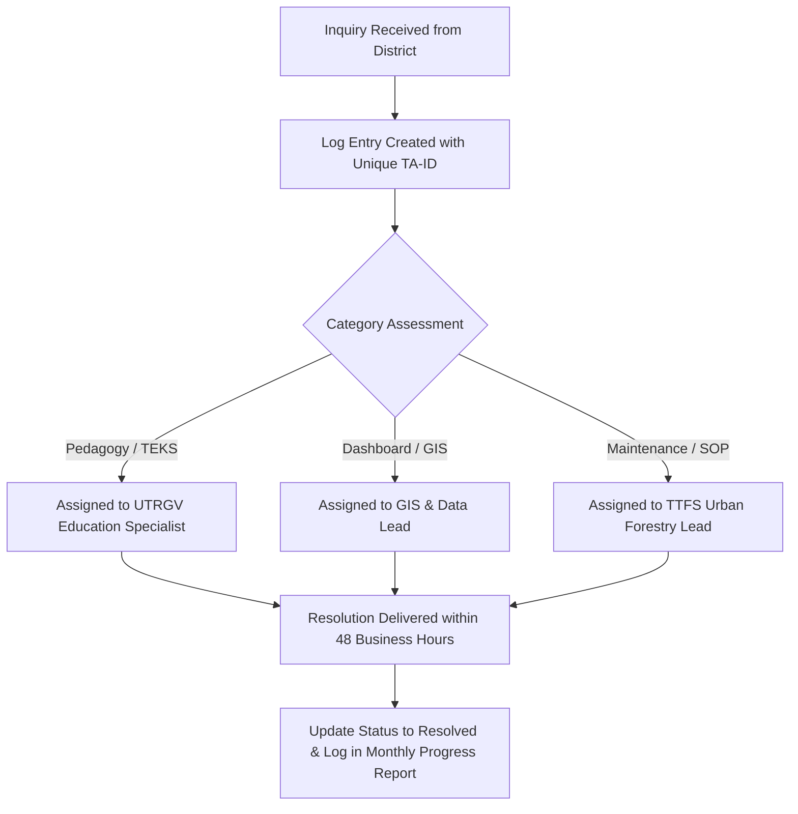

# 📋 Environmental Data Collection — Technical Assistance (TA) Log Schema

> **Contract Deliverable:** SOW Deliverable D — Training & Technical Assistance Materials v0.5 (August 2026 Milestone)  
> **Prepared for:** Texas Trees Foundation & UTRGV Project Cool Schools  
> **Audience:** School Administrators, STEM Teachers, Facilities Staff, Project Coordinators  

---

## 1. Purpose & Governance

The Technical Assistance (TA) Log tracks inquiries, technical requests, dashboard onboarding sessions, and field assistance delivered to participating school districts (Donna ISD and Mercedes ISD). 

This schema satisfies Texas A&M Forest Service compliance requirements for auditable technical support, tracking response time, query category, and resolution status while ensuring **strict FERPA/COPPA zero-PII standards**.

---

## 2. Technical Assistance Log Schema

Every TA interaction must be recorded in the standardized logging format below:

| Field Name | Type | Description | Allowed Values / Format |
| :--- | :--- | :--- | :--- |
| `Log_ID` | String | Unique sequential identifier | `TA-2026-XXXX` |
| `Date_Logged` | Date | Date inquiry was received | `YYYY-MM-DD` |
| `District` | Enum | Participating school district | `Donna ISD`, `Mercedes ISD`, `UTRGV Agroecology`, `TTFS Internal` |
| `Campus` | String | Specific campus name | e.g. `M. Rivas Primary`, `J.W. Caceres Elementary` |
| `Role_Title` | Enum | Anonymized stakeholder title | `Campus Principal`, `STEM Educator`, `Lead Grounds/Facility`, `Instructional Coach` |
| `Category` | Enum | Focus area of assistance | `Dashboard Navigation`, `SOP Protocol / Field Form`, `TEKS Lesson Plan Support`, `Hardware / Sensor Support`, `Data Export Request` |
| `Inquiry_Summary` | String | Concise description of request | Max 250 characters (No student PII) |
| `Support_Method` | Enum | Mode of assistance delivery | `On-site Walkthrough`, `Virtual Video Call`, `Email / Asynchronous`, `SOP Documentation Dispatch` |
| `Assigned_Lead` | String | Support team member | `Desi (UTRGV)`, `Graduate Research Assistant`, `TTFS Specialist` |
| `Status` | Enum | Current resolution status | `Open`, `In Progress`, `Resolved`, `Escalated` |
| `Date_Resolved` | Date | Date resolution was confirmed | `YYYY-MM-DD` |

---

## 3. Active Technical Assistance Ledger (Baseline & Sprint Records)

### Table 1: Technical Assistance Log Records (August 2026 Baseline)

| Log ID | Date | District | Campus | Role Title | Category | Inquiry Summary | Support Method | Status | Date Resolved |
| :--- | :--- | :--- | :--- | :--- | :--- | :--- | :--- | :--- | :--- |
| `TA-2026-0001` | 2026-08-03 | Donna ISD | M. Rivas Primary | Campus Principal | Dashboard Navigation | Requested walkthrough of campus boundary polygon layers and surface calculation percentages. | Virtual Video Call | **Resolved** | 2026-08-04 |
| `TA-2026-0002` | 2026-08-07 | Donna ISD | J.W. Caceres Elem | STEM Educator | TEKS Lesson Plan Support | Inquired about 4th/5th grade TEKS-aligned outdoor shade and temperature lesson plan integration. | SOP Documentation Dispatch | **Resolved** | 2026-08-08 |
| `TA-2026-0003` | 2026-08-12 | Mercedes ISD | Chacon Middle | Lead Grounds/Facility | SOP Protocol / Field Form | Clarified tree caliper measurement protocols (DBH) and watering checklist frequencies. | On-site Walkthrough | **Resolved** | 2026-08-14 |
| `TA-2026-0004` | 2026-08-18 | Mercedes ISD | Travis Elementary | Instructional Coach | Dashboard Navigation | Requested guidance on accessing species breakdown and economic carbon savings metrics. | Virtual Video Call | **Resolved** | 2026-08-19 |
| `TA-2026-0005` | 2026-08-24 | Donna ISD | Runn Elementary | STEM Educator | Hardware / Sensor Support | Calibration checklist assistance for handheld infrared surface temperature thermometers. | Email / Asynchronous | **Resolved** | 2026-08-25 |

---

## 4. Technical Assistance Escalation Protocol

1. **Intake SLA:** All district inquiries must be logged within 24 hours of receipt.
2. **Resolution Target:** Standard inquiries resolved within 48 hours; on-site technical support scheduled within 5 business days.
3. **Monthly Reporting:** All closed and active TA logs are aggregated and submitted in the monthly TTFS progress reports.
