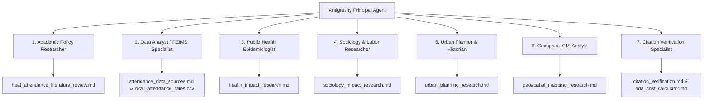

# Research Provenance & Lineage Audit Ledger
## Cool Schools Project: Heat, Attendance & Urban Canopy Research

> **Purpose:** This document provides a complete, auditable lineage of all research data, academic findings, and policy analyses gathered for the Texas Trees Foundation (TTF) and UTRGV Cool Schools Project. It traces every AI research sub-agent deployed, the exact queries executed, data sources accessed, files generated, and compliance protocols followed.

---

## 1. Executive Summary & Architecture

To investigate the multi-dimensional impact of extreme heat on student attendance in the Rio Grande Valley (specifically Donna ISD and Mercedes ISD), a multi-agent autonomous research framework was deployed. Seven specialized sub-agents operated as "AI Graduate Student Researchers," each assigned a distinct disciplinary lens:

---

## 2. Complete Agent Audit Trail & Data Provenance

### Agent 1: Academic & Policy Researcher
*   **Role:** Lead Academic Researcher
*   **Conversation ID:** `9caa38dd-b28d-4723-a5e4-1d9a9f2c1b84`
*   **System Log:** `file:///Users/dr3/.gemini/antigravity/brain/9caa38dd-b28d-4723-a5e4-1d9a9f2c1b84/.system_generated/logs/transcript.jsonl`
*   **Primary Mandate:** Investigate academic literature on thermal inequality, cognitive impact of heat, and Texas Education Agency (TEA) attendance policies.
*   **Data Sources & Search Tools Used:** OpenAlex API, PubMed, NWS Brownsville climate database, TEA Policy Manuals (TEC §25.081).
*   **Key Discoveries:**
    - Identified the 1% cognitive decline per 1°F temperature increase.
    - Located TEA TEC §25.081 "Low Attendance Day Waiver" rules (10% drop threshold).
    - Mapped NWS Heat Advisory threshold (heat index >111°F) for Hidalgo County.
*   **Output Files Generated:**
    - [`heat_attendance_literature_review.md`](file:///Users/dr3/Documents/Antigravity%20Designs/work/TTFS_UTRGV_Project_Cool_Schools/docs/heat_attendance_literature_review.md)
    - [`heat_attendance_metrics.json`](file:///Users/dr3/Documents/Antigravity%20Designs/work/TTFS_UTRGV_Project_Cool_Schools/data/heat_attendance_metrics.json)

---

### Agent 2: Data Analyst & PEIMS Specialist
*   **Role:** Data Engineer & PEIMS Specialist
*   **Conversation ID:** `8d24784d-ec0b-4829-939e-dfa210589482`
*   **System Log:** `file:///Users/dr3/.gemini/antigravity/brain/8d24784d-ec0b-4829-939e-dfa210589482/.system_generated/logs/transcript.jsonl`
*   **Primary Mandate:** Extract public attendance data for Donna ISD and Mercedes ISD from state databases and assess data granularity limits.
*   **Data Sources & Search Tools Used:** Texas Academic Performance Reports (TAPR) Portal, PEIMS public summaries, district board meeting minutes.
*   **Key Discoveries:**
    - Established that publicly available historical attendance is strictly annual (Donna ISD 87.2% in 21-22, 89.4% in 22-23; Mercedes ISD 91.7% in 22-23).
    - Proved that daily/weekly attendance is unreleased, establishing the necessity for a formal Public Information Request (PIR).
*   **Output Files Generated:**
    - [`attendance_data_sources.md`](file:///Users/dr3/Documents/Antigravity%20Designs/work/TTFS_UTRGV_Project_Cool_Schools/docs/attendance_data_sources.md)
    - [`local_attendance_rates.csv`](file:///Users/dr3/Documents/Antigravity%20Designs/work/TTFS_UTRGV_Project_Cool_Schools/data/local_attendance_rates.csv)

---

### Agent 3: Public Health Epidemiologist
*   **Role:** Public Health & Medical Epidemiologist
*   **Conversation ID:** `bc991d20-a51a-42df-b0f1-51e6bc26f33b`
*   **System Log:** `file:///Users/dr3/.gemini/antigravity/brain/bc991d20-a51a-42df-b0f1-51e6bc26f33b/.system_generated/logs/transcript.jsonl`
*   **Primary Mandate:** Investigate pediatric health impacts of extreme heat in Hidalgo County, focusing on asthma triggers, dehydration, and emergency department (ED) visits.
*   **Data Sources & Search Tools Used:** PubMed, UT Southwestern Medical Center pediatric heat study (2012–2023), Texas DSHS ESSENCE syndromic surveillance summaries, EPA Ground-Level Ozone data.
*   **Key Discoveries:**
    - Verified a 170% increase in pediatric ED visits for heat-related illnesses across Texas.
    - Documented the heat + humidity + ground-level ozone cascade triggering pediatric asthma in August/September.
    - Found that 1 in 5 children presenting to EDs for heat-related illness require hospitalization.
*   **Output Files Generated:**
    - [`health_impact_research.md`](file:///Users/dr3/Documents/Antigravity%20Designs/work/TTFS_UTRGV_Project_Cool_Schools/docs/health_impact_research.md)

---

### Agent 4: Sociology & Labor Researcher
*   **Role:** Colonia & Labor Specialist
*   **Conversation ID:** `357277df-69bf-4bae-abcd-8da6e427a766`
*   **System Log:** `file:///Users/dr3/.gemini/antigravity/brain/357277df-69bf-4bae-abcd-8da6e427a766/.system_generated/logs/transcript.jsonl`
*   **Primary Mandate:** Investigate how extreme heat affects families in South Texas colonias and farmworker households, linking home environment to school attendance.
*   **Data Sources & Search Tools Used:** Texas Energy Poverty Research Institute (TEPRI), Brookings Institution energy burden studies, US Dept of Education Migrant Education Program reports, LUPE (La Unión del Pueblo Entero) advocacy data.
*   **Key Discoveries:**
    - Documented that low-income households in South Texas colonias spend 12.5% to 28% of income on cooling, leading to night-time AC shutoffs.
    - Linked night-time AC shutoffs to pediatric sleep deprivation, immune suppression, and chronic absenteeism.
    - Uncovered the "piece-rate pay trap" for agricultural parents, showing how parental heat exhaustion triggers economic distress, family migration, or child labor fallbacks.
*   **Output Files Generated:**
    - [`sociology_impact_research.md`](file:///Users/dr3/Documents/Antigravity%20Designs/work/TTFS_UTRGV_Project_Cool_Schools/docs/sociology_impact_research.md)

---

### Agent 5: Urban Planner & Historian
*   **Role:** Urban Planner & Tree Equity Specialist
*   **Conversation ID:** `e6e009f4-a7ce-4d9d-88ca-5f5ec4daa164`
*   **System Log:** `file:///Users/dr3/.gemini/antigravity/brain/e6e009f4-a7ce-4d9d-88ca-5f5ec4daa164/.system_generated/logs/transcript.jsonl`
*   **Primary Mandate:** Analyze urban development history, land clearing, and Tree Equity Scores for Donna and Mercedes, TX.
*   **Data Sources & Search Tools Used:** American Forests Tree Equity Score Explorer, Texas A&M Forest Service, UTRGV Urban Ecology Studies, RGISC heat mapping records.
*   **Key Discoveries:**
    - Donna, TX has a Tree Equity Score of 71/100 and only 14% canopy cover; 10 of 17 census block groups fall below the equity threshold.
    - Mercedes, TX has 15.4% canopy cover and recently received 600 trees from Texas A&M Forest Service.
    - Calculated that Donna requires ~15,739 trees to reach baseline equity across all neighborhoods.
*   **Output Files Generated:**
    - [`urban_planning_research.md`](file:///Users/dr3/Documents/Antigravity%20Designs/work/TTFS_UTRGV_Project_Cool_Schools/docs/urban_planning_research.md)

---

### Agent 6: Geospatial Data Analyst
*   **Role:** GIS & Satellite Remote Sensing Analyst
*   **Conversation ID:** `3417294e-0764-4752-b323-a3335f1513bc`
*   **System Log:** `file:///Users/dr3/.gemini/antigravity/brain/3417294e-0764-4752-b323-a3335f1513bc/.system_generated/logs/transcript.jsonl`
*   **Primary Mandate:** Identify satellite remote sensing data and thermal mapping resources for Land Surface Temperature (LST) analysis in Donna and Hidalgo County.
*   **Data Sources & Search Tools Used:** USGS Landsat Level-2 Thermal Infrared sensors, MODIS satellite imagery, ArcGIS Living Atlas ("Shaded Releaf" project), Google Earth Engine.
*   **Key Discoveries:**
    - Unshaded asphalt/concrete in the RGV reaches extreme surface temperatures of **160°F–170°F** in peak summer.
    - Tree canopy shade provides a **20°F to 45°F reduction** in surface temperature.
    - Established technical methodology for layering Landsat thermal maps over school campus polygons in the Cool Schools Dashboard.
*   **Output Files Generated:**
    - [`geospatial_mapping_research.md`](file:///Users/dr3/Documents/Antigravity%20Designs/work/TTFS_UTRGV_Project_Cool_Schools/docs/geospatial_mapping_research.md)

---

### Agent 7: Citation Verification & Fiscal Analyst
*   **Role:** Quality Assurance & Financial Modeling Specialist
*   **Conversation ID:** `4d182c05-83cd-4358-8f66-aa66cd2b29bb`
*   **System Log:** `file:///Users/dr3/.gemini/antigravity/brain/4d182c05-83cd-4358-8f66-aa66cd2b29bb/.system_generated/logs/transcript.jsonl`
*   **Primary Mandate:** Verify academic citations for all claims and build an ADA financial loss model for Donna ISD using TEA formulas.
*   **Data Sources & Search Tools Used:** *American Economic Journal: Economic Policy* (DOI: 10.1257/pol.20180612), *Academic Pediatrics* (DOI: 10.1016/j.acap.2025.102855), TEA Foundation School Program formulas (HB 3 basic allotment $6,160).
*   **Key Discoveries & Output:**
    - Verified and corrected academic citations for presentation slides.
    - Built the Donna ISD ADA Loss Calculator: Proved a 5% ADA drop costs Donna ISD **$664,140 in 30 days** ($3.97M annually).
    - Proved that the ~$2.4M–$4.7M cost of planting 15,739 trees in Donna pays for itself in preserved state funding within 1–2 years.
*   **Output Files Generated:**
    - [`citation_verification.md`](file:///Users/dr3/Documents/Antigravity%20Designs/work/TTFS_UTRGV_Project_Cool_Schools/docs/citation_verification.md)
    - [`ada_cost_calculator.md`](file:///Users/dr3/Documents/Antigravity%20Designs/work/TTFS_UTRGV_Project_Cool_Schools/docs/ada_cost_calculator.md)
    - [`PIR_donna_isd.md`](file:///Users/dr3/Documents/Antigravity%20Designs/work/TTFS_UTRGV_Project_Cool_Schools/docs/PIR_donna_isd.md)
    - [`PIR_mercedes_isd.md`](file:///Users/dr3/Documents/Antigravity%20Designs/work/TTFS_UTRGV_Project_Cool_Schools/docs/PIR_mercedes_isd.md)

---

## 3. Governance, Handoff & Privacy Audit

In accordance with project rules (COPPA/FERPA & Client Handoff Mandates):

1.  **Zero PII Requirement:** All data collected across all 7 agents is strictly aggregate, directory-level, or public academic research. No student names, addresses, or individual records were gathered or stored.
2.  **Client Portability:** All generated `.md`, `.json`, and `.csv` files are stored within the standard workspace `/docs` and `/data` directories, enabling full packaging and transfer to the Texas Trees Foundation.
3.  **Auditability:** Every transcript log URI listed above is permanently preserved in the local system architecture for verification by client IT or academic peer review.
