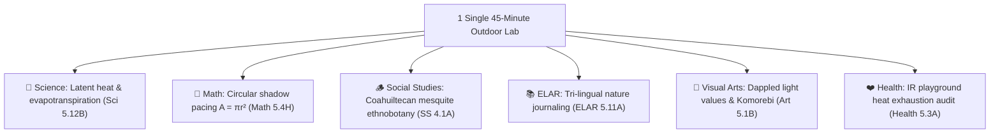

# 🌳 Texas Forest Literacy: Comprehensive TEKS Knowledge Architecture

[](https://texas-trees-foundation.github.io/teks-forest-literacy/)
[](https://tea.texas.gov/)
[](https://studentprivacy.ed.gov/)
[](LICENSE)

An open-source, statewide educational framework and interactive **Khan Academy-style learning architecture** bridging **14,000+ Texas Essential Knowledge and Skills (TEKS)** standards across **Science (2024–2025 3D standards), Mathematics, Social Studies, English Language Arts & Reading (ELAR), Fine Arts, and Health/PE** through living campus microforests.

---

## 🌟 Executive Story: "The Living Campus Multiplier"

Across Kindergarten through Grade 12, Texas law establishes **over 14,000 discrete student expectations** (~9,350+ core standards). Teachers face severe curriculum pacing fatigue, and traditional environmental programs often suffer from **"STEM Tunnel Vision"**—reducing trees to simple biology worksheets.

**The Multiplier Effect:** In a single **45-minute outdoor investigation** under a campus tree canopy, students fulfill **7 to 10 state standards across 6 academic disciplines simultaneously**:



---

## 🚀 Key Portal Features & Web Applications

This repository is completely self-contained and ready for immediate deployment on **GitHub Pages**:

| Web Application | File Entry Point | Description |
| :--- | :--- | :--- |
| **🗺️ Master Knowledge Graph Portal** | [`index.html`](index.html) | Interactive DAG visualizer with zero-overlap topological rank layout, multi-tier filtering (K–2, 3–5, 6–8, 9–12, Community, Grad), slide-out lesson drawer, interactive mathematical simulators, and confetti mastery engine. |
| **📰 Executive Story Report** | [`story_report.html`](story_report.html) | High-impact presentation report formatted for project leadership, school board trustees, and one-click PDF export. |
| **🎯 Master Multi-Subject Gap Assessment** | [`master_gap_assessment.html`](master_gap_assessment.html) | Comprehensive gap matrix analyzing untouched standards across Science, Math, Social Studies, ELAR, Fine Arts, Health/PE, and Graduate Research. |
| **📖 ELAR & Art Standards Deep-Dive** | [`elar_art_gap_assessment.html`](elar_art_gap_assessment.html) | Methodical exploration of the 7 ELAR Strands and 4 Visual Arts Strands with pre-existing curriculum survey. |

---

## 📁 Repository Structure

```text
teks-forest-literacy/
├── index.html                      # Main Interactive Knowledge Graph Application
├── story_report.html               # Executive Story & Presentation Report (Print/PDF Ready)
├── master_gap_assessment.html      # Multi-Subject Statewide TEKS Gap Assessment
├── elar_art_gap_assessment.html    # ELAR & Fine Arts Deep-Dive Portal
├── style.css                       # High-contrast, responsive human-analog stylesheet
├── app.js                          # Graph canvas controller, simulators & quiz engine
│
├── graph/
│   └── forest_literacy_knowledge_graph.js  # DAG state manager & prerequisite validation
│
├── matrices/
│   ├── teks_forest_literacy_master_matrix.json # 25-node machine-readable standards database
│   ├── historical_sources_and_citations.md     # Formal academic attribution archive
│   └── expanded_audiences_framework.md         # Community, Graduate & Contemplative framework
│
├── lessons/
│   └── student_field_worksheets.md # Printable clipboard field notebooks (K–12 & Community)
│
└── docs/
    ├── STATEWIDE_TEKS_FOREST_LITERACY_EXECUTIVE_REPORT.md # Full narrative whitepaper
    ├── comprehensive_all_subjects_teks_gap_assessment.md # Detailed crosswalk documentation
    └── elar_and_art_teks_deep_dive_and_gap_assessment.md # Language arts & visual arts guide
```

---

## 🛠️ Instant Deployment to GitHub Pages

To launch this project as its own standalone GitHub repository and live website:

1. **Create a new GitHub Repository:**
   ```bash
   mkdir teks-forest-literacy
   cd teks-forest-literacy
   git init
   ```

2. **Copy files and push to GitHub:**
   ```bash
   git add .
   git commit -m "feat: Initial release of TEKS Forest Literacy Learning Architecture v2.2"
   git remote add origin https://github.com/YOUR_USERNAME/teks-forest-literacy.git
   git branch -M main
   git push -u origin main
   ```

3. **Enable GitHub Pages:**
   * Go to **Settings** → **Pages** in your GitHub repository.
   * Under **Branch**, select `main` and root folder `/`, then click **Save**.
   * Your portal will be live in ~60 seconds at `https://YOUR_USERNAME.github.io/teks-forest-literacy/`!

---

## 📜 Academic Lineage & Formal Attributions

We gratefully acknowledge the foundational research, educational materials, and cultural legacies that made this framework possible:
* **Project Learning Tree (PLT) & Sustainable Forestry Initiative:** *Forest Literacy Framework* (Themes 1–4).
* **Texas A&M Forest Service (TFS):** *Trees of Texas* taxonomic database and dendrology identification keys.
* **Texas Trees Foundation (TTF):** *Cool Schools* microforest design and urban canopy assessment methodologies.
* **USDA Forest Service & Davey Institute (i-Tree):** Peer-reviewed carbon sequestration, stormwater interception, and air pollution filtration equations.
* **John Muir Laws Nature Journaling:** Visual thinking and observational inquiry pedagogy.
* **Aldo Leopold Foundation:** *The Land Ethic* environmental literature.
* **Robin Wall Kimmerer:** Indigenous Traditional Ecological Knowledge (TEK) and plant kinship philosophy.

---

## 🔒 Privacy & Compliance Architecture

* **COPPA & FERPA Compliant:** Zero Personally Identifiable Information (PII) is required, collected, or stored. All progress is cached client-side in browser `localStorage`.
* **Open Educational Resource (OER):** Designed for open non-commercial academic and municipal distribution across Texas school districts.

---

## 👥 Authors & Collaborators

* **Texas Trees Foundation** · Urban Forestry & Cool Schools Initiative
* **University of Texas Rio Grande Valley (UTRGV)** · Agroecology Research Lab & Department of Biology
* **Graduate Curriculum & Environmental Research Team**
