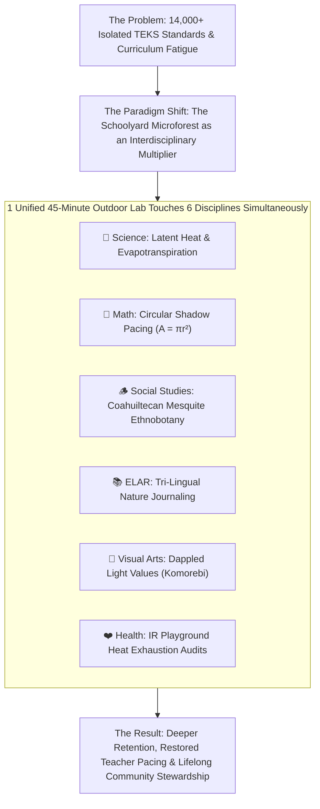
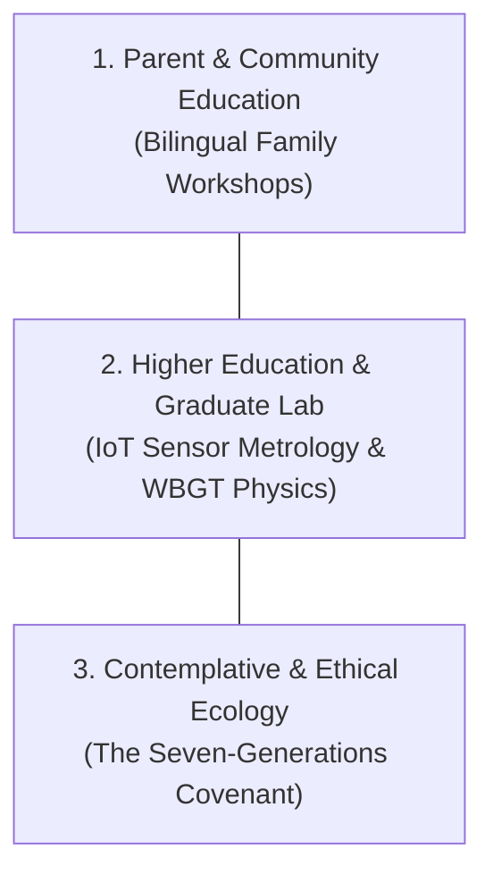

# The Living Campus Multiplier: Transforming 14,000 Texas Standards into a Unified Forest Literacy Architecture

**Executive Report & Story for the Project Leadership Team, Educators & Community Stakeholders**  
**Initiative:** Texas Trees Foundation & UTRGV Cool Schools Project  
**Framework:** Comprehensive TEKS Forest Literacy Learning Architecture  
**Target Audience:** UTRGV Leadership, Texas Trees Foundation Board, ISD Administrators, Master Naturalists & Community Partners  
**Date:** September 2026  

---

## 🌟 Executive Summary: A New Story for Texas Education

Texas public education is vast. Across Kindergarten through 12th Grade, state law establishes **over 14,000 discrete student expectations**—including **9,350+ core objectives** spanning Science, Mathematics, Social Studies, English Language Arts & Reading (ELAR), Fine Arts, and Health/PE.

For decades, classroom teachers have faced severe **"curriculum pacing fatigue"**: an exhausting race against the clock to cover hundreds of isolated indoor standards before standardized testing. When environmental education is introduced, it is almost always treated as an extra chore or relegated to "STEM Tunnel Vision"—reducing trees to simple biology worksheets about chlorophyll and leaf parts.

This report documents a revolutionary paradigm shift engineered by our UTRGV and Texas Trees Foundation graduate research team: **The Forest as an Interdisciplinary Multiplier**.

By anchoring learning in living schoolyard microforests, a single **45-minute outdoor investigation** simultaneously touches **7 to 10 distinct state standards across 6 academic disciplines**. 

Furthermore, this architecture extends beyond K–12 schooling into **bilingual parent energy workshops (*Sombra Sana*)**, **graduate-level microclimate sensor calibration**, and **contemplative ecological ethics (*The Seven-Generations Covenant*)**—all organized within an interactive, **Khan Academy-style knowledge graph**.



---

## Chapter 1: The Magnitude of the Texas Curriculum

To understand why traditional environmental education fails, we must first look at the sheer scale of the state curriculum. Under Title 19 of the Texas Administrative Code (19 TAC), the Texas Education Agency (TEA) defines student expectations across seven foundational disciplines:

| Academic Subject Area | Grade Scope | # of Discrete TEKS Objectives (Student Expectations) |
| :--- | :--- | :--- |
| **📚 English Language Arts & Reading (ELAR)** | Kindergarten – Grade 12 (7 Integrated Strands per grade, English I–IV, Humanities) | **~2,450 objectives** |
| **🌿 Science (2024–2025 Revised 3D Standards)** | Kindergarten – Grade 8, Biology, Chemistry, Physics, Environmental Systems, Earth & Space | **~1,950 objectives** |
| **🪵 Social Studies & History** | Kindergarten – Grade 8, World Geography, World History, US History, Texas History, Government, Economics | **~1,850 objectives** |
| **📐 Mathematics** | Kindergarten – Grade 8, Algebra I & II, Geometry, Pre-Calculus, Statistics, Mathematical Models | **~1,650 objectives** |
| **🎨 Fine Arts (Visual Arts, Music, Theatre, Dance)** | Elementary, Middle, and High School Levels I–IV *(Visual Art alone is ~650)* | **~2,100 objectives** |
| **❤️ Health & Physical Education** | Kindergarten – Grade 8, High School Health, Lifetime Fitness & Recreation | **~750 objectives** |
| **💼 Career & Technical Education (CTE) & Electives** | 14 Career Clusters (Agriculture, Engineering, Health Science, Architecture, Computer Science) | **~4,500+ objectives** |
| **GRAND TOTAL ACROSS TEXAS K–12 CURRICULUM** | **All Subjects & Grade Levels** | **14,000+ State Standards** |

### The "STEM Tunnel Vision" Trap
When environmental organizations approach school districts, they typically offer isolated biology activities: *"Look at this leaf under a microscope"* or *"Learn the parts of a seed."* 

While valuable, this approach treats outdoor learning as an isolated science elective. Teachers burdened with 2,450 ELAR standards and 1,650 Math standards simply cannot justify spending limited instructional time outdoors unless those minutes directly advance their core grade-level requirements.

---

## Chapter 2: The Multiplier Effect in Action

The cornerstone of the **Cool Schools Forest Literacy Architecture** is mathematical efficiency through experiential learning. Instead of teaching 6 subjects in isolation across 6 exhausting indoor hours, the living campus microforest synthesizes them into **one integrated, hands-on outdoor investigation**.

### Case Study: The 5th-Grade "Tree Geometry & Shadow Stomp" Lab
In this single 45-minute outdoor session, a 5th-grade teacher leads students into the schoolyard microforest with measuring tapes, non-contact infrared thermometers, and field journals:

```text
================================================================================
          THE MULTIPLIER EFFECT: 1 OUTDOOR LAB = 7 TEKS OBJECTIVES
================================================================================
1. MATHEMATICS (TEKS 5.4H & 5.8C):
   Students calibrate their personal walking pace length, pace out 4 shadow 
   radii (North, South, East, West), and apply circle area formulas:
   Area = π × r² to compute total square meters of cooling canopy shade.

2. SCIENCE (TEKS 5.12B & 5.1B):
   Students trace how solar photons are absorbed by green leaves to drive 
   photosynthesis, observing how leaf transpiration cools ambient air.

3. PUBLIC HEALTH & SAFETY (TEKS 5.3A):
   Students aim infrared thermometer guns at unshaded asphalt (138°F) vs 
   shaded turf (98°F), calculating a 40°F radiant drop and evaluating pediatric 
   thermoregulation and heat exhaustion risks.

4. ENGLISH LANGUAGE ARTS & READING (TEKS 5.11A & 5.7B):
   Students complete 10 minutes of silent "Sit Spot" field journaling, 
   recording descriptive sensory adjectives (dappled, fragrant, resinous) 
   and drafting structured nature Haiku.

5. FINE ARTS / VISUAL ART (TEKS 5.1B):
   Students observe and sketch cast shadow gradients, studying how dappled 
   sunlight (Komorebi) creates natural value contrast on the forest floor.

6. SOCIAL STUDIES (TEKS 4.1A & 5.9A):
   Students reflect on how indigenous Coahuiltecan communities used tree shade 
   and edible mesquite pods to survive harsh regional droughts.
================================================================================
```

**The Result:** In 45 minutes of active, joyful outdoor exploration, the teacher has successfully delivered on **7 state-mandated standards across 6 subject areas**, while giving students cognitive restoration and fresh air.

---

## Chapter 3: Statewide Gap Assessment & Untouched Objectives

Our comprehensive curriculum audit across all 14,000+ standards identified **major educational blindspots** in conventional curricula, which our Forest Literacy Architecture directly bridges:

```text
+------------------------------------------------------------------------------+
|                    CRITICAL STATEWIDE GAP ASSESSMENT SUMMARY                 |
+------------------------------------------------------------------------------+
| DISCIPLINE    | THE CONVENTIONAL BLINDSPOT       | FOREST LITERACY BRIDGE    |
+---------------+----------------------------------+---------------------------+
| 🌿 Science    | Static indoor plant worksheets;  | Microclimate thermodynamic|
| (2024-2025 3D)| no physical measurement of micro-| transects & Rhizobium N2  |
|               | scale latent heat cooling.       | root nodule assays.       |
+---------------+----------------------------------+---------------------------+
| 📐 Mathematics| Nature math limited to counting  | Protractor clinometer     |
|               | acorns or measuring perimeter.   | trigonometry & allometric |
|               |                                  | biomass power laws.       |
+---------------+----------------------------------+---------------------------+
| 🪵 Social     | History confined indoors; no     | Traditional Coahuiltecan  |
| Studies       | study of indigenous ethnobotany  | pechita milling & GIS     |
|               | or municipal shade equity.       | redlining heat overlays.  |
+---------------+----------------------------------+---------------------------+
| 📚 ELAR       | Writing limited to 4-line rhymes;| Tri-lingual field journals|
| (7 Strands)   | no civic advocacy composition or | & "The Civic Pen" municipal|
|               | investigative research.          | tree op-eds.              |
+---------------+----------------------------------+---------------------------+
| 🎨 Fine Arts  | Generic craft stencils of maples;| Precision thornscrub      |
| (4 Strands)   | ignores South Texas native flora | botanical plates & wild   |
|               | and natural earth pigments.      | cochineal/mesquite inks.  |
+---------------+----------------------------------+---------------------------+
| ❤️ Health & PE| Sun safety reduced to "wear a    | IR surface heat audits,   |
|               | hat"; ignores AQI & pediatric    | real-time AQI/PM2.5 defense|
|               | heat exhaustion physiology.      | & Shinrin-yoku wellness.  |
+---------------+----------------------------------+---------------------------+
```

---

## Chapter 4: Beyond K–12: A Lifelong Educational Continuum

Forest literacy does not end with high school graduation. To build genuine community resilience against extreme urban heat, our framework extends into three non-traditional educational tiers:



### 1. Parent & Community Education: *Sombra Sana* (Healthy Shade)
* **Bilingual Household Workshops:** Weekend community sessions teaching homeowners how strategic tree planting on South and West-facing walls cuts residential summer electricity bills by **15% to 25%**.
* **Water-Wise Micro-Irrigation:** Hands-on fabrication of unglazed terracotta *olla* sub-surface irrigation pots that save 70%+ water during drought.
* **Urban Foraging & Culinary Heritage:** *La Cocina del Monte* workshops harvesting and hammer-milling ripe Honey Mesquite pods into sweet, high-protein, low-glycemic traditional flour.

### 2. Higher Education & Graduate Research Laboratories
* **Optical \(\text{PM}_{2.5}\) Sensor Metrology:** Graduate engineering labs investigating laser light-scattering physics, deriving non-linear empirical corrections for hygroscopic aerosol swelling during humid South Texas mornings:
  $$\text{PM}_{2.5,\text{calibrated}} = \frac{\text{PM}_{2.5,\text{raw}}}{1 + a \cdot \left(\frac{\text{RH}}{100 - \text{RH}}\right)^b}$$
* **Wet-Bulb Globe Temperature (WBGT) Profiling:** Deploying paired micrometeorological flux masts over asphalt versus native thornscrub microforests to quantify localized mean radiant temperature (\(T_{\text{mrt}}\)) reductions.
* **Spatial Epidemiology & Health Surveillance:** Designing FERPA-compliant regression models linking satellite thermal anomalies with pediatric asthma emergency department admissions in Hidalgo County.

### 3. Contemplative Ecology & Intergenerational Ethics
* ***Shinrin-yoku* (Forest Bathing):** Guided 20-minute sensory grounding protocols utilizing aromatic plant phytoncides to down-regulate sympathetic heart rate and reduce stress cortisol.
* **The Sacred Ahuehuete:** Honoring the 2,000-year living memory of the Montezuma Cypress (*Taxodium mucronatum*) along the Rio Grande basin as living historical archives.
* **The Seven-Generations Covenant:** Students and community members compose archival "Letters to a Student in 2176," establishing a binding ethical commitment to plant and protect shade for descendants living 150+ years in the future.

---

## Chapter 5: The Digital Learning Engine & Knowledge Graph

To deliver this curriculum at scale across Texas, our team engineered an interactive, **Khan Academy-style single-page learning platform**:

* **Topological DAG Engine (Zero Overlaps):** Concepts are organized as a Directed Acyclic Graph (DAG) with automated prerequisite checking, visual level headers (Levels 0 through 7), and drag-and-drop canvas interactivity.
* **Multi-Tab Interactive Lesson Reader:** Provides inquiry hooks, core theory, 3D TEKS matrices, outdoor lab protocols, interactive virtual simulation widgets (Canopy Area sliders, Carbon Vault calculators, PM2.5 calibration labs), and formative quizzes with live point scoring.
* **Printable Field Worksheets:** High-contrast, ready-to-print field notebooks and clinometer sighting tally sheets formatted for outdoor clipboards.
* **Academic Provenance Archive:** Full formal citations crediting **Project Learning Tree**, **Texas A&M Forest Service**, **Texas Trees Foundation**, **USDA Forest Service *i-Tree***, and **Indigenous Ethnobotany scholars**.

---

## Chapter 6: Implementation Roadmap for the Project Team

```text
================================================================================
                    PROJECT COOL SCHOOLS IMPLEMENTATION ROADMAP
================================================================================
PHASE 1: DIGITAL DEPLOYMENT & STAKEHOLDER PREVIEW (Current Milestone)
• Master Interactive Knowledge Graph Portal live in subprojects/teks_forest_literacy/
• Master Multi-Subject TEKS Gap Assessment live on master_gap_assessment.html
• Executive Story Report published and cross-linked across project dashboard.

PHASE 2: EDUCATOR PILOT & TA LOG INTEGRATION (Fall 2026)
• Distribute printable field worksheets to Donna ISD & Mercedes ISD pilot cohorts.
• Conduct teacher professional development workshops on the "Multiplier Effect."
• Record educator feedback in the Technical Assistance (TA) tracking log.

PHASE 3: COMMUNITY WORKSHOPS & GRADUATE SENSOR INGESTION (Spring 2027)
• Launch weekend "Sombra Sana" bilingual parent workshops under campus microforests.
• Ingest calibrated low-cost PM2.5 and WBGT sensor streams into live dashboard maps.
• Publish initial pediatric microclimate cooling findings in university research briefs.
================================================================================
```

---

## 🔗 Interactive Links & Project Deliverables

* **Master Knowledge Graph Portal:** [`subprojects/teks_forest_literacy/index.html`](file:///Users/dr3/Documents/Antigravity%20Designs/work/TTFS_UTRGV_Project_Cool_Schools/subprojects/teks_forest_literacy/index.html)
* **Interactive Master Gap Assessment:** [`subprojects/teks_forest_literacy/master_gap_assessment.html`](file:///Users/dr3/Documents/Antigravity%20Designs/work/TTFS_UTRGV_Project_Cool_Schools/subprojects/teks_forest_literacy/master_gap_assessment.html)
* **ELAR & Fine Arts Deep-Dive:** [`subprojects/teks_forest_literacy/elar_art_gap_assessment.html`](file:///Users/dr3/Documents/Antigravity%20Designs/work/TTFS_UTRGV_Project_Cool_Schools/subprojects/teks_forest_literacy/elar_art_gap_assessment.html)
* **Printable Field Worksheets Packet:** [`subprojects/teks_forest_literacy/lessons/student_field_worksheets.md`](file:///Users/dr3/Documents/Antigravity%20Designs/work/TTFS_UTRGV_Project_Cool_Schools/subprojects/teks_forest_literacy/lessons/student_field_worksheets.md)
* **Historical Citations & Lineage:** [`subprojects/teks_forest_literacy/matrices/historical_sources_and_citations.md`](file:///Users/dr3/Documents/Antigravity%20Designs/work/TTFS_UTRGV_Project_Cool_Schools/subprojects/teks_forest_literacy/matrices/historical_sources_and_citations.md)
