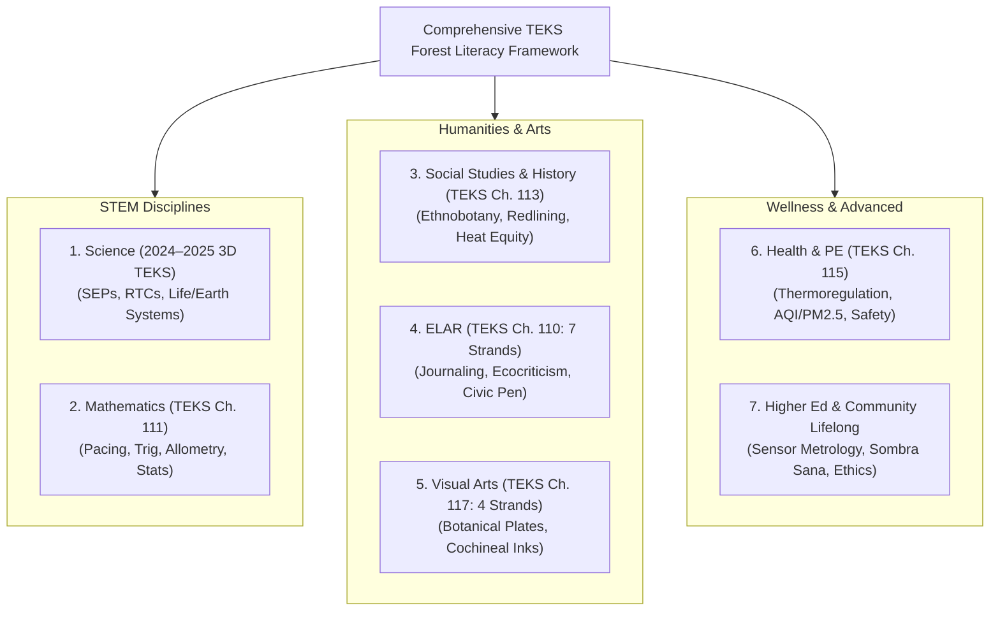

# Comprehensive Multi-Subject TEKS Gap Assessment & Curriculum Crosswalk

**Project:** Texas Trees Foundation & UTRGV Cool Schools Project  
**Framework:** All-Encompassing TEKS Forest Literacy Architecture  
**Scope:** All Subjects (Science, Math, Social Studies, ELAR, Fine Arts, Health/PE) across All Grade Levels (K–2, 3–5, 6–8, 9–12, Higher Ed & Community)  
**Authors:** Graduate Research Team in Pedagogical Sciences, Agroecology, Public Health & Educational Measurement  

---

## 🌿 Executive Summary & Pedagogical Vision

Most outdoor and environmental education programs suffer from **"STEM Tunnel Vision"**: they treat trees strictly as biology objects—naming plant parts, measuring leaf lengths, and defining photosynthesis. 

While core biology is essential, this narrow framing leaves **over 80% of state-mandated Texas Essential Knowledge and Skills (TEKS) objectives untouched** in outdoor settings. 

When a schoolyard transforms from an asphalt desert into a vibrant native microforest, it becomes a living laboratory for:
* **Three-Dimensional Science:** Controlled thermodynamics, microclimate fluxes, and soil macro-porosity.
* **Rigorous Mathematics:** Right-triangle clinometer trigonometry, circular shadow geometry, and non-linear biomass power laws.
* **Civic History & Geography:** Regional indigenous ethnobotany, historical redlining, and urban heat equity.
* **Language Arts & Rhetoric:** Tri-lingual sensory journaling, environmental ecocriticism, and municipal advocacy letters.
* **Fine Arts:** Precision botanical illustration plates, natural thornscrub pigments, and data-driven eco-art.
* **Public Health & Physical Education:** Pediatric thermoregulation, extreme heat index safety, and PM2.5 air defense.
* **Lifelong & Higher Education:** Bilingual home energy workshops, graduate optical sensor calibration, and contemplative ecological ethics.

This document provides a slow, methodical, standard-by-standard **Gap Assessment** for every academic subject across all grade bands.

---

## 1. Multi-Subject TEKS Framework Map

---

## 2. Granular Gap Assessment by Subject & Grade Level

---

### Domain 1: Science (19 TAC Chapter 112 - 2024–2025 Revised 3D Standards)

The State of Texas fully implemented the revised Science TEKS in the 2024–2025 school year, transitioning from two-dimensional learning to **Three-Dimensional Learning**:
1. **Scientific and Engineering Practices (SEPs)**
2. **Recurring Themes and Concepts (RTCs)**
3. **Disciplinary Core Content**

#### Grade-Band Gaps & Forest Literacy Bridges

| Grade Band | The Traditional Educational Blindspot | Untouched Science TEKS | Forest Literacy Curriculum Bridge |
| :--- | :--- | :--- | :--- |
| **K–2 Primary** | Science is limited to static indoor worksheets naming roots and leaves. Students rarely experience how physical bark acts as protective armor in extreme heat. | `Sci K.12A`, `1.12B`, `2.12B` (Structure & Function; Protective adaptations) | **Module: "Tree Hugger Sensory Anatomy"** Students physically inspect and touch rough, corky Honey Mesquite bark, observing how thick bark shields internal vascular cambium from blistering South Texas heat. |
| **3–5 Elementary** | Food webs are drawn as flat circular arrows on paper without connecting back to solar photon capture and the loss of energy across trophic levels in native biomes. | `Sci 3.12B`, `4.12B`, `5.12B` (Energy and Matter; Ecosystem Interdependence) | **Module: "Yarn Web of Life & Solar Energy Flow"** Students simulate multi-tiered trophic energy transfers from sunlight to native producers (Mesquite), primary consumers, predators, and decomposers. |
| **6–8 Middle School** | Urban heat is taught as an abstract global concept without measuring micro-scale thermodynamic differences between asphalt and living, transpiring canopy foliage. | `Sci 6.9A`, `7.9A`, `8.9C` (Thermal Energy Transfers, Systems & System Models) | **Module: "Microclimate Thermodynamics & Albedo Transect"** Students conduct 200m physical transects with digital thermometers, quantifying latent heat cooling (evapotranspiration) vs sensible heat radiation. |
| **9–12 High School** | Biology and Environmental Systems teach nitrogen cycles and ecology through synthetic chemical diagrams, ignoring symbiotic native polycultures. | `Bio 12B`, `EnvSys 4E`, `AquaticSci 5B` (Nutrient Cycles, Agroecological Resilience) | **Module: "Urban Agroecology & Tamaulipan Polycultures"** Students extract root cores of wild native legumes (Texas Ebony, Retama) to observe pink leghaemoglobin in *Rhizobium* nodules fixing atmospheric N2 into fertile soil. |

---

### Domain 2: Mathematics (19 TAC Chapter 111)

#### Grade-Band Gaps & Forest Literacy Bridges

| Grade Band | The Traditional Educational Blindspot | Untouched Math TEKS | Forest Literacy Curriculum Bridge |
| :--- | :--- | :--- | :--- |
| **K–2 Primary** | Measurement is taught using plastic rulers on flat classroom desks. Students do not learn to measure non-standard natural objects or spatial distances outdoors. | `Math K.7A`, `1.7B`, `2.9D` (Comparative length, non-standard units) | **Module: "Body Pacing & Tree Trunk Hugs"** Students use arm-spans and foot-paces to measure trunk circumference and shadow lengths, comparing standard vs non-standard measurement units. |
| **3–5 Elementary** | Area and perimeter are taught exclusively as rectangular squares on grid paper (\(A = l \times w\)). Students never learn to approximate real-world organic circular shapes in nature. | `Math 3.6C`, `4.8C`, `5.4H` (Area, Perimeter & Real-World Geometric Modeling) | **Module: "Tree Geometry: Pacing & Circular Shade Footprint"** Students calibrate their personal step pace, pace out 4 shadow radii (N, S, E, W), and apply \(A = \pi r^2\) to compute shaded cooling square footage. |
| **6–8 Middle School** | Right-triangle trigonometry and tangent ratios are taught as abstract textbook diagrams without real-world forestry applications. | `Math 7.5C`, `8.7C`, `8.8D` (Proportions, Right Triangles & Tangent Ratios) | **Module: "Forestry Trigonometry: DIY Clinometer Height Sweep"** Students build protractor clinometers, sight canopy tops at a 15m baseline, and apply \(\text{Height} = (D \cdot \tan \theta) + h_{\text{eye}}\). |
| **9–12 High School** | Advanced math (Algebra II, Pre-Calculus, Statistics) rarely connects with environmental economics or non-linear biological allometry. | `Pre-Calc 2I`, `EnvSys 2J`, `Stats 3A` (Non-linear Logarithmic Regressions) | **Module: "Allometric Biomass & i-Tree Engine Mathematics"** Students formulate power-law regressions \(\ln(M) = a + b \cdot \ln(\text{DBH})\), calculate dry biomass carbon stock, and monetize air quality filtration value ($/metric ton CO2e). |

---

### Domain 3: Social Studies & History (19 TAC Chapter 113)

#### Grade-Band Gaps & Forest Literacy Bridges

| Grade Band | The Traditional Educational Blindspot | Untouched Social Studies TEKS | Forest Literacy Curriculum Bridge |
| :--- | :--- | :--- | :--- |
| **K–2 Primary** | Social studies focuses on school rules and basic maps, ignoring how trees provide public common goods and shape schoolyard physical geography. | `SS K.4B`, `1.5A`, `2.5A` (Physical Geography & Community Shared Resources) | **Module: "Our Campus Neighborhood: Mapping Shade Sanctuaries"** Students draw physical bird's-eye maps of their schoolyard, identifying sunny danger zones and shaded communal gathering places. |
| **3–5 Elementary** | Texas History focuses on wars and political figures, completely omitting how indigenous nations (Coahuiltecan, Karankawa) sustainably used native flora for thousands of years. | `SS 3.4A`, `4.1A`, `4.21A` (Indigenous Cultures & Human-Environment Interaction) | **Module: "Roots of the RGV: Indigenous Ethnobotany & Mesquite"** Students explore the historical use of Honey Mesquite as a "Tree of Life," inspecting ripe *pechita* bean pods and milling traditional high-protein sweet flour. |
| **6–8 Middle School** | Texas History views 19th/20th-century agriculture solely through mechanized irrigation, ignoring the environmental consequences of clear-cutting native thornscrub. | `SS 7.2A`, `7.9A`, `8.29C` (Texas Agricultural History & Regional Land Transformations) | **Module: "From 'Nuisance Weed' to Keystone: Mesquite History"** Students analyze historical agricultural records, evaluating how clear-cutting native deep-rooted scrub contributed to soil erosion and intensified regional heat. |
| **9–12 High School** | Geography and Government classes treat urban planning as abstract zoning, ignoring historical redlining and modern municipal shade equity disparities. | `World Geog 16C`, `World Hist 28E`, `Gov 14A` (Municipal Zoning, Infrastructure Equity) | **Module: "Environmental Justice: Redlining & Urban Heat Equity"** Students overlay 1930s Home Owners' Loan Corporation (HOLC) redlining maps with satellite thermal Landsat rasters to analyze modern canopy disparities. |

---

### Domain 4: English Language Arts & Reading (19 TAC Chapter 110)

#### Grade-Band Gaps & Forest Literacy Bridges

| Grade Band | The Traditional Educational Blindspot | Untouched ELAR TEKS (7 Strands) | Forest Literacy Curriculum Bridge |
| :--- | :--- | :--- | :--- |
| **K–2 Primary** | Language arts instruction is confined indoors with flashcards. Students miss out on rich, sensory outdoor vocabulary acquisition. | `ELAR K.1B`, `1.1C`, `2.1E` (Strand 1: Oral Language & Sensory Descriptors) | **Module: "Tree Hugger Sensory Vocabulary Walk"** Students acquire vivid, tactile vocabulary (*furrowed, resinous, dappled, fragrant, rough*) through direct physical contact with living trees. |
| **3–5 Elementary** | Nature writing is limited to generic rhyming poetry. Students are not taught multi-sensory field observation or dual-language journaling. | `ELAR 3.11A`, `4.11A`, `5.11B` (Strand 3 & 6: Nature Journaling & Sensory Prose) | **Module: "Diario de la Naturaleza: Tri-Lingual Nature Journaling"** Students practice 15-minute "Sit Spot" journaling using tri-lingual prompts (English, Español, TexMex) to compose descriptive reflections and Haiku. |
| **6–8 Middle School** | Informational reading and inquiry are disconnected from the school campus. Students rarely conduct primary interviews or campus research. | `ELAR 6.12D`, `7.9F`, `8.12D` (Strand 5 & 7: Author's Craft & Inquiry Reports) | **Module: "Campus Microclimate Investigative Research Brief"** Students formulate inquiry questions, gather playground temperature data, interview school staff, and draft a formal informational report for the principal. |
| **9–12 High School** | Argumentative writing is practiced on hypothetical prompts (e.g., "Should school uniforms be banned?"), ignoring authentic civic engagement. | `Eng I.11C`, `Eng II.11C`, `Eng III.11C` (Strand 6: Argumentative & Civic Composition) | **Module: "The Civic Pen: Municipal Shade Advocacy & Op-Eds"** Students analyze neighborhood heat data, draft formal evidence-backed letters to school boards, and submit op-eds advocating for tree investments. |

---

### Domain 5: Fine Arts / Visual Arts (19 TAC Chapter 117)

#### Grade-Band Gaps & Forest Literacy Bridges

| Grade Band | The Traditional Educational Blindspot | Untouched Fine Arts TEKS (4 Strands) | Forest Literacy Curriculum Bridge |
| :--- | :--- | :--- | :--- |
| **K–2 Primary** | Art activities use generic store-bought plastic stencils rather than exploring natural textures and biological forms. | `Art K.1A`, `1.2B`, `2.2B` (Strands 1 & 2: Natural Textures & Tactile Media) | **Module: "Eco-Canvas: Tactile Bark Rubbings & Leaf Prints"** Students tape newsprint to tree trunks and rub unwrapped earth-tone wax crayons to transfer unique bark topographical fingerprints into print. |
| **3–5 Elementary** | Drawing instruction focuses on flat 2D outlines without teaching how natural sunlight creates value, contrast, and cast shadow depth. | `Art 3.1B`, `4.1B`, `5.1B` (Strand 1: Observation of Light, Value & Shadow) | **Module: "Komorebi: Shaded Light & Shadow Value Studies"** Students sit under a canopy observing dappled light (*Komorebi*) filtering through foliage, creating value scales from bright highlights to deep cast shadows. |
| **6–8 Middle School** | Art projects are purely decorative, missing the historical link between botanical science and scientific illustration plates. | `Art 6.2A`, `7.2A`, `8.2A` (Strand 2: Precision Scientific Botanical Drawing) | **Module: "Botanical Plates of South Texas Thornscrub"** Students use fine-line graphite and stippling techniques to draw proportioned scientific plates of Texas Ebony pods and Anacua foliage. |
| **9–12 High School** | High school art relies on synthetic acrylic paints, ignoring traditional sustainable media, natural earth pigments, and eco-art commentary. | `Art I.2C`, `Art III.3A`, `Art IV.3A` (Strands 2, 3 & 4: Natural Dyes & Eco-Art) | **Module: "Wild Pigments & Thermal Contour Eco-Art"** Students forage mesquite pods and prickly pear juice to make non-toxic natural watercolors, combining thermal GIS data with tree-ring illustrations. |

---

### Domain 6: Health & Physical Education (19 TAC Chapter 115)

#### Grade-Band Gaps & Forest Literacy Bridges

| Grade Band | The Traditional Educational Blindspot | Untouched Health / PE TEKS | Forest Literacy Curriculum Bridge |
| :--- | :--- | :--- | :--- |
| **K–2 Primary** | Sun safety is reduced to "put on a hat," without teaching children to recognize their body's hydration needs and shade signals. | `Health K.1A`, `1.3B`, `2.3A` (Body Awareness, Hydration & Environmental Safety) | **Module: "The Thirsty Tree & Thirsty Me: Hydration Check"** Students learn how both human bodies and tree roots need water to stay cool, practicing regular hydration habits before and after outdoor play. |
| **3–5 Elementary** | Heat illness is taught in health textbooks, but students play on unshaded 135°F blacktop playgrounds without understanding heat exhaustion risks. | `Health 3.1A`, `4.3B`, `5.3A` (Thermoregulation, Heat Exhaustion Prevention) | **Module: "Beat the Heat: Infrared Surface Temperature Audit"** Students aim non-contact infrared thermometers at asphalt courts vs shaded grass, recognizing early symptoms of heat exhaustion (dizziness, fatigue). |
| **6–8 Middle School** | PE fitness tests occur outdoors in peak heat without monitoring real-time Air Quality Index (AQI) or localized particulate matter (\(\text{PM}_{2.5}\)). | `Health 6.3A`, `7.3B`, `8.3C` (Environmental Health Risks & Respiratory Defense) | **Module: "Air Defense: AQI, Particulates & Tree Canopy Filtration"** Students analyze EPA AirNow / PurpleAir readings, correlating how dense tree foliage captures airborne particulate matter to protect developing lungs. |
| **9–12 High School** | Mental health and stress management are taught through indoor slides, ignoring the proven clinical benefits of outdoor nature immersion. | `Health I.1B`, `Lifetime Fitness 2A` (Stress Management & Physiological Rest) | **Module: "Shinrin-yoku: Parasympathetic Stress Reduction Protocol"** Students practice silent canopy immersion, learning how volatile phytoncides released by trees lower cortisol and blood pressure. |

---

### Domain 7: Expanded & Lifelong Educational Dimensions

#### Community, Higher Education & Contemplative Bridges

| Audience / Tier | The Conventional Blindspot | The Expanded Domain | Forest Literacy Curriculum Bridge |
| :--- | :--- | :--- | :--- |
| **Parent & Community** | Schools treat parents as passive spectators rather than active partners in home environmental energy conservation. | Household Energy Efficiency & Bilingual Urban Agriculture | **Module: "Sombra Sana: Backyard Shade Placement & Ollas"** Bilingual weekend workshops teaching families how planting native trees on West-facing walls cuts electric bills by 20%+, plus DIY terracotta olla irrigation. |
| **Higher Ed & Graduate Lab** | University research remains locked in academic journals, never directly feeding into K–12 schoolyard microclimate monitoring. | Environmental Sensor Metrology & Spatial Epidemiology | **Module: "Optical PM2.5 Humidity Calibration & WBGT Masts"** Graduate students deploy ESP32 IoT sensors, derive non-linear humidity correction curves, and model pediatric thermal morbidity reductions. |
| **Cultural & Spiritual** | Environmental education is strictly transactional (carbon credits, board feet), ignoring the sacred and intergenerational kinship with living trees. | Contemplative Ecology, Sacred Groves & Intergenerational Ethics | **Module: "The Sacred Ahuehuete & Seven-Generations Covenant"** Exploring the 2,000-year history of the Montezuma Cypress (*Ahuehuete*) and composing archival commitments for descendants 150+ years in the future. |

---

## 3. Survey of Pre-Existing Materials & Formal Attribution

In compliance with academic integrity standards, we give formal credit to all pre-existing curricula, agencies, and scholars whose foundational work informed this gap assessment:

1. **Project Learning Tree (PLT) & Sustainable Forestry Initiative (SFI):**  
   *Foundational Contribution:* *Forest Literacy Framework* (Themes 1–4) and classic activities (*Poet-Tree*, *Web of Life*, *How Big is Your Tree?*).  
   *Citation:* Project Learning Tree. (2020). *Forest Literacy Framework*. Washington, D.C.
2. **Texas A&M Forest Service (TFS):**  
   *Foundational Contribution:* *Trees of Texas* identification keys, dendrology databases, and conservation education manuals.  
   *Citation:* Texas A&M Forest Service. (2023). *Trees of Texas Taxonomic Guide*. College Station, TX.
3. **USDA Forest Service & Davey Tree Expert Co. (i-Tree):**  
   *Foundational Contribution:* Peer-reviewed urban forestry equations for carbon storage, stormwater interception, and air pollution filtration.  
   *Citation:* Nowak, D. J., et al. (2006). *Air pollution removal by urban trees*. Urban Forestry & Urban Greening.
4. **John Muir Laws Nature Journaling:**  
   *Foundational Contribution:* Visual thinking and nature journaling pedagogy (*"I Notice, I Wonder, It Reminds Me Of"*).  
   *Citation:* Laws, J. M., & Lygren, E. (2020). *How to Teach Nature Journaling*. Heyday Books.
5. **Aldo Leopold Foundation:**  
   *Foundational Contribution:* The *Land Ethic* environmental literature and philosophical writing curriculum.  
   *Citation:* Leopold, A. (1949). *A Sand County Almanac*. Oxford University Press.
6. **Robin Wall Kimmerer:**  
   *Foundational Contribution:* Indigenous Traditional Ecological Knowledge (TEK), plant kinship, and environmental ethics.  
   *Citation:* Kimmerer, R. W. (2013). *Braiding Sweetgrass: Indigenous Wisdom, Scientific Knowledge and the Teachings of Plants*. Milkweed Editions.
7. **Texas Department of State Health Services (DSHS) & CDC:**  
   *Foundational Contribution:* Pediatric heat illness surveillance data, ESSENCE emergency department heat stress trends, and Social Vulnerability Index (SVI).  
   *Citation:* Texas DSHS. (2023). *Public Health Heat-Related Illness Surveillance in South Texas*. Austin, TX.
