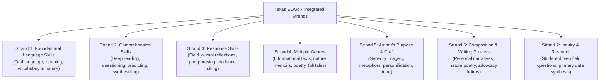
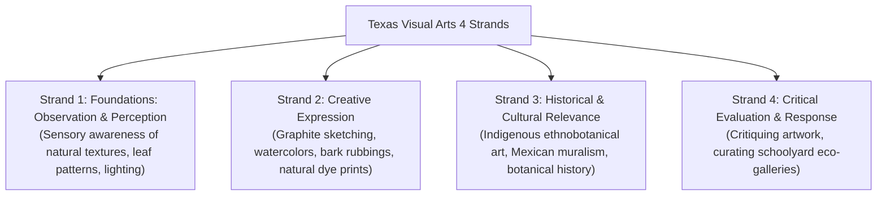

# Deep-Dive Pedagogical Guide: ELAR & Fine Arts TEKS Integration & Gap Assessment

**Project:** Texas Trees Foundation & UTRGV Cool Schools Project  
**Framework:** Comprehensive Forest Literacy Learning Architecture  
**Focus Domains:** English Language Arts and Reading (ELAR - 19 TAC Chapter 110) & Visual Arts (19 TAC Chapter 117)  
**Authors:** Graduate Research Team in Pedagogical Sciences, Humanities & Environmental Education  

---

## 🌿 Welcome & Philosophical Overview

When people think about "trees and forests in schools," their minds almost always jump straight to biology or environmental science—chlorophyll, photosynthesis, root systems, and weather. 

However, when a child or adult sits beneath a mature native tree, their experience is profoundly **human, sensory, linguistic, and emotional**:
* They hear the wind whispering through leaves and search for words to capture that sound (**Language Arts & Poetry**).
* They observe the intricate spiral patterns in pinecones or the rough, rugged texture of mesquite bark and want to draw or paint it (**Visual Art & Observation**).
* They read stories about how past generations survived beneath these trees and write letters to protect them for future children (**Civic Composition & Rhetoric**).

This guide provides a comprehensive, slow, and methodical examination of all **Texas Essential Knowledge and Skills (TEKS)** standards in **ELAR** and **Fine Arts**, surveys pre-existing curriculum materials, identifies critical educational gaps, and presents actionable solutions for every grade band.

---

## 1. Understanding the Texas ELAR TEKS Architecture (19 TAC Chapter 110)

The Texas State Board of Education organizes all ELAR standards from Kindergarten through 12th Grade into **Seven Integrated Strands**. Across all grade levels, students develop reading, writing, speaking, listening, and thinking through these 7 pillars:



---

### Grade-by-Grade ELAR Strands & Forest Literacy Applications

#### A. Primary Band (Kindergarten – Grade 2)
* **Strand 1: Oral Language & Sensory Vocabulary (`K.1B`, `1.1C`, `2.1E`)**
  * *Standard:* Developing rich descriptive oral vocabulary through direct physical observation.
  * *Forest Application:* Students learn specialized sensory words (e.g., *rough, furrowed, dappled, fragrant, resinous, canopy, evergreen*) while touching campus bark.
* **Strand 3: Response in Nature Journals (`K.6B`, `1.7B`, `2.7B`)**
  * *Standard:* Dictating or writing personal reactions to what was observed outdoors.
  * *Forest Application:* "Sit Spot" field sketches with 2-word sensory descriptors (e.g., "warm cedar", "soft shade").
* **Strand 4: Folktales & Fables (`K.8A`, `1.9A`, `2.9A`)**
  * *Standard:* Identifying characters, settings, and moral themes in traditional fables.
  * *Forest Application:* Listening to indigenous stories of the Honey Mesquite, discovering how animals in the brushland helped one another survive droughts.

#### B. Intermediate / Elementary Band (Grades 3 – 5)
* **Strand 2: Deep Informational Comprehension (`3.6G`, `4.6G`, `5.6H`)**
  * *Standard:* Synthesizing multi-paragraph informational texts and making text-to-world connections.
  * *Forest Application:* Reading forestry brochures or historical records of Rio Grande Valley land use and explaining how trees protect human communities from heat waves.
* **Strand 5: Author's Craft & Figurative Language (`3.10D`, `4.10D`, `5.10D`)**
  * *Standard:* Analyzing figurative language: similes, metaphors, personification, and sensory imagery.
  * *Forest Application:* Analyzing nature poetry (e.g., Mary Oliver or Robert Frost) and identifying metaphors (e.g., *"The tree's canopy is a green umbrella shielding the playground"*).
* **Strand 6: Personal Narrative & Structured Poetry (`3.11A`, `4.11A`, `5.11B`)**
  * *Standard:* Writing structured descriptive narratives and poems with sensory organization.
  * *Forest Application:* Composing original Haiku (5-7-5 syllables) or Cinquains reflecting on shade, heat, and biodiversity.

#### C. Middle School Band (Grades 6 – 8)
* **Strand 5: Rhetorical Voice & Tone (`6.9F`, `7.9F`, `8.9F`)**
  * *Standard:* Analyzing how authors use diction and tone to influence an audience's perspective.
  * *Forest Application:* Comparing how 19th-century agricultural pamphlets viewed mesquite as a "nuisance weed" versus modern agroecology recognizing it as an indispensable keystone species.
* **Strand 7: Inquiry & Evidence Synthesis (`6.12D`, `7.12D`, `8.12D`)**
  * *Standard:* Formulating student-driven research questions, gathering primary and secondary evidence, and presenting conclusions.
  * *Forest Application:* Conducting a campus shade survey, interviewing teachers about playground heat, gathering temperature data, and drafting a formal research brief for the school principal.

#### D. High School Band (Grades 9 – 12: English I–IV, AP Language & Literature)
* **Strand 6: Civic & Argumentative Composition (`Eng I.11C`, `Eng II.11C`, `Eng III.11C`)**
  * *Standard:* Composing complex, evidence-based argumentative essays addressing authentic public issues.
  * *Forest Application:* Writing formal civic advocacy proposals to municipal city councils or school boards arguing for equitable urban canopy investments in historically redlined neighborhoods.
* **Strand 4: Environmental Literature & Ecocriticism (`Eng III.7D`, `Eng IV.7D`)**
  * *Standard:* Evaluating philosophical, historical, and cultural texts across American and World literature.
  * *Forest Application:* Reading Aldo Leopold's *The Land Ethic*, Robin Wall Kimmerer's *Braiding Sweetgrass*, and Mexican-American borderland literature to explore human reciprocal kinship with native flora.

---

## 2. Understanding the Texas Visual Arts TEKS Architecture (19 TAC Chapter 117)

The Texas Fine Arts TEKS for Visual Arts are built upon **Four Foundational Strands** that nurture artistic perception, creative expression, cultural context, and critical reflection:



---

### Grade-by-Grade Art Strands & Forest Literacy Applications

#### A. Primary Band (Kindergarten – Grade 2)
* **Strand 1: Sensory Observation (`K.1A`, `1.1A`, `2.1A`)**
  * *Standard:* Identifying line, color, texture, and shape in the natural environment.
  * *Forest Application:* Comparing the zigzag branching patterns of Retama with the weeping, drooping willow-like boughs of Montezuma Cypress.
* **Strand 2: Tactile Media Expression (`K.2B`, `1.2B`, `2.2B`)**
  * *Standard:* Using physical materials (crayons, paper, natural textures) to express visual ideas.
  * *Forest Application:* Creating multi-colored wax bark rubbings and leaf silhouette prints using fallen leaves.

#### B. Intermediate / Elementary Band (Grades 3 – 5)
* **Strand 1: Light, Shadow & Depth (`3.1B`, `4.1B`, `5.1B`)**
  * *Standard:* Observing and depicting how natural sunlight creates value, contrast, and cast shadows.
  * *Forest Application:* Drawing the dappled sunlight (*Komorebi*) filtering through leaves onto the forest floor.
* **Strand 3: Regional Cultural Art Traditions (`3.3A`, `4.3A`, `5.3B`)**
  * *Standard:* Investigating art and crafts created by distinct historical and cultural communities.
  * *Forest Application:* Exploring how South Texas indigenous artists used natural earth pigments and mesquite resin to decorate pottery and woven mats.

#### C. Middle School Band (Grades 6 – 8)
* **Strand 2: Precision Botanical Illustration (`6.2A`, `7.2A`, `8.2A`)**
  * *Standard:* Applying proportion, perspective, and fine linework to render realistic organic subjects.
  * *Forest Application:* Creating scientific botanical plates of native species (e.g., Texas Ebony seedpods, Anacua leaves with sandpapery surface stippling) using graphite and watercolor.
* **Strand 4: Environmental Aesthetics & Critique (`6.4B`, `7.4B`, `8.4B`)**
  * *Standard:* Analyzing how public art and outdoor landscape design affect human emotion and community well-being.
  * *Forest Application:* Evaluating the visual and emotional contrast between an unshaded asphalt parking lot and a shaded native tree grove.

#### D. High School Band (Grades 9 – 12: Art I–IV, AP Studio Art)
* **Strand 2: Sustainable Natural Media & Eco-Art (`Art I.2C`, `Art II.2C`, `Art III.2C`)**
  * *Standard:* Experimenting with non-traditional, sustainable media to create meaningful conceptual artwork.
  * *Forest Application:* Foraging non-living materials (mesquite pods, fallen bark, prickly pear juice) to create natural botanical dyes, charcoal sticks, and site-specific environmental sculptures (*Land Art*).
* **Strand 3: Art as Ecological Commentary (`Art III.3A`, `Art IV.3A`)**
  * *Standard:* Researching how contemporary artists engage with ecological crises and climate change.
  * *Forest Application:* Creating visual data installations (e.g., overlapping infrared heat maps with tree ring cross-sections) to communicate urban heat vulnerability to the public.

---

## 3. Survey of Pre-Existing Materials & Historical Discovery (Giving Credit)

To ensure we give full credit where credit is due, our team surveyed decades of environmental curricula and arts initiatives:

| Program / Organization | Key Historical Contributions | Limitations & What Is Missing |
| :--- | :--- | :--- |
| **Project Learning Tree (PLT)** | Pioneered *Poet-Tree* (Activity 5), *Adopt a Tree* (Activity 21), and *The Closer You Look* (Activity 61). Excellent general K–8 classroom activities. | Activities treat ELAR and Art mostly as "craft add-ons" rather than rigorous standards. Zero coverage of high school environmental rhetoric, civic advocacy writing, or South Texas thornscrub species. |
| **John Muir Laws Nature Journaling** | World-standard nature journaling pedagogical framework (*"I Notice, I Wonder, It Reminds Me Of"*). Promotes visual thinking and scientific observation. | Heavy focus on California / Pacific Northwest flora. Needs adaptation for semi-arid Tamaulipan Thornscrub, extreme heat safety, and bilingual Spanish/TexMex language learners. |
| **Texas Commission on the Arts (TCA)** | Funds regional public murals and traditional folk art documentation across Texas communities. | Programs are rarely linked systematically to outdoor schoolyard microforests or state science/math curricula. |
| **Aldo Leopold Foundation** | *The Land Ethic* curriculum exploring environmental philosophy and human ecological conscience. | Designed primarily for high school and university philosophy/AP lit; rarely bridged downward to elementary or middle school classroom writing. |
| **Robin Wall Kimmerer (*Braiding Sweetgrass*)** | Indigenous Traditional Ecological Knowledge (TEK), grammar of animacy, and linguistic kinship with plants. | Seminal text, but lacks standard-by-standard Texas TEKS crosswalk matrices for classroom teachers. |

---

## 4. The Comprehensive Gap Assessment: Untouched Standards & Solutions

Our audit revealed **Four Major Educational Gaps** in how ELAR and Art are taught outdoors in Texas schools:

```text
================================================================================
                    CRITICAL EDUCATIONAL GAP ASSESSMENT MATRIX
================================================================================

[ GAP 1: THE ELAR INQUIRY & CIVIC RHETORIC GAP (Strands 6 & 7) ]
- The Problem: Most environmental programs treat ELAR as merely "write a 4-line poem."
  Middle and High School students are rarely taught to use writing as an authentic 
  tool of civic power, investigative journalism, or municipal advocacy.
- Untouched TEKS: ELAR 6.12D, 8.12D, Eng I.11C, Eng III.11C (Argumentative & Civic Writing).
- Our Solution: Module "Civic Pen: Municipal Shade Advocacy & Community Letters." 
  Students analyze neighborhood heat disparities, draft formal letters to school 
  trustees, and publish op-eds advocating for campus tree investments.

--------------------------------------------------------------------------------
[ GAP 2: THE REGIONAL ETHNOBOTANICAL & INDIGENOUS ARTS GAP (Art Strand 3) ]
- The Problem: Standard art curriculum uses generic temperate trees (apples, maples).
  South Texas students never learn the rich artistic traditions of their own biome 
  (Coahuiltecan natural dyes, Mesquite woodcarving, Mexican-American muralism).
- Untouched TEKS: Fine Arts 3.3A, 5.3B, Art II.3A (Cultural Heritage in Visual Art).
- Our Solution: Module "Roots of the RGV: Indigenous Pigments & Eco-Canvas."
  Students forage fallen mesquite pods and prickly pear fruit to create non-toxic 
  natural watercolor pigments and study traditional borderland textile arts.

--------------------------------------------------------------------------------
[ GAP 3: THE BILINGUAL & MULTI-SENSORY FIELD JOURNALING GAP (ELAR Strands 1 & 3) ]
- The Problem: Language arts materials are almost exclusively monolingual English, 
  ignoring the rich linguistic reality of South Texas (English, Español, and TexMex).
- Untouched TEKS: ELAR K.1B, 2.1E, 4.7B (Bilingual oral language & personal reflection).
- Our Solution: Module "Diario de la Naturaleza: Bilingual Sit Spot Journaling."
  Provides tri-lingual sensory word banks (*fresco, áspero, sombra, crujiente*) 
  allowing students to express their relationship with nature in their authentic voice.

--------------------------------------------------------------------------------
[ GAP 4: THE DATA-DRIVEN VISUAL ECO-ART GAP (Art Strands 1 & 2) ]
- The Problem: Art is treated as separate from STEM data. Students draw trees from 
  imagination rather than translating actual environmental data into visual artwork.
- Untouched TEKS: Fine Arts 6.2A, 8.2A, Art I.2C (Translating Observation into Form).
- Our Solution: Module "Thermal Topography & Tree Ring Visual Art."
  Students combine infrared surface temperature data with tree-ring growth patterns 
  to produce stunning mixed-media scientific illustration plates.
================================================================================
```

---

## 5. Master ELAR & Art Standards Crosswalk Table

| Grade Band | Subject | Specific TEKS Standard | Focus Description | Forest Literacy Lesson Module |
| :--- | :--- | :--- | :--- | :--- |
| **K–2** | ELAR | `110.2.b.1.B` / `110.3.b.1.C` | Oral language sensory descriptors | *Tree Hugger Sensory Vocabulary Walk* |
| **K–2** | Art | `117.102.b.1.A` / `117.105.b.2.B` | Bark textures and leaf pattern rubbings | *Eco-Canvas: Tactile Bark Gallery* |
| **3–5** | ELAR | `110.5.b.11.A` / `110.6.b.11.B` | Descriptive nature poetry and Haiku | *Sensory Nature Journaling & Tree Poetry* |
| **3–5** | Art | `117.111.b.1.B` / `117.114.b.1.B` | Dappled light and cast shadow drawing | *Komorebi: Shaded Light & Shadow Values* |
| **3–5** | ELAR | `110.6.b.6.G` / `110.7.b.6.G` | Informational reading on canopy benefits | *Roots of the RGV: Ethnobotany Reading* |
| **6–8** | ELAR | `110.22.b.9.F` / `110.24.b.9.F` | Analyzing historical author tone and bias | *From 'Weed' to Keystone: Mesquite Rhetoric* |
| **6–8** | Art | `117.202.b.2.A` / `117.204.b.2.A` | Precision botanical scientific illustration | *Botanical Plates of South Texas Thornscrub* |
| **6–8** | ELAR | `110.24.b.12.D` | Primary research & interview synthesis | *Campus Microclimate Investigative Report* |
| **9–12** | ELAR | `110.36.c.11.C` / `110.38.c.11.C` | Civic argumentative advocacy writing | *The Civic Pen: Municipal Shade Advocacy* |
| **9–12** | Art | `117.302.c.2.C` / `117.304.c.2.C` | Sustainable natural dyes & Land Art | *Wild Pigments: Cochineal & Mesquite Inks* |
| **9–12** | ELAR | `110.38.c.7.D` | Ecocriticism and environmental ethics | *Aldo Leopold & Robin Kimmerer Seminar* |
| **9–12** | Art | `117.305.c.3.A` | Environmental public art commentary | *Thermal Contours & Growth Ring Eco-Art* |
