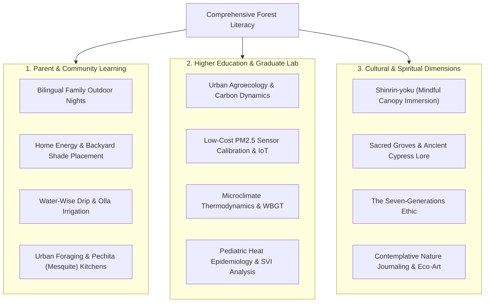

# Expanded Audiences Framework: Lifelong, Community, Higher Education & Spiritual Forest Literacy

**Project:** Texas Trees Foundation & UTRGV Cool Schools Project  
**Subproject:** Comprehensive Forest Literacy Curriculum  
**Lead Authors:** Graduate Research Team (Agroecology, Public Health, Education, & Cultural Studies)

---

## 1. Overview & Pedagogical Philosophy

Forest Literacy is not confined to standard K–12 classroom walls. A resilient urban canopy requires an intergenerational, community-wide, and philosophically grounded understanding of trees and ecosystems. 

This framework establishes tailored learning pathways for three distinct non-K–12 cohorts:
1. **Parent & Community Education (Bilingual / Intergenerational Family Workshops)**
2. **Higher Education & Graduate Level (Agroecology, Sensor Physics & Environmental Epidemiology)**
3. **Cultural, Humanistic & Spiritual Dimensions (Contemplative Ecology & Traditional Ethnobotany)**

---

## 2. Parent & Community Education Pathway

### 2.1. Target Audience & Cultural Competency
* **Demographics:** Parents, grandparents, and community members in Donna, Mercedes, and Hidalgo County.
* **Language Modalities:** Tri-lingual delivery (English, Spanish, and regional South Texas bilingual/TexMex terminology).
* **Accessibility:** Hands-on evening and weekend workshops held under schoolyard microforests and community parks; zero technical prerequisites.

### 2.2. Core Community Modules

#### Module C-1: *Sombra Sana* (Healthy Shade: Planting for Lower Electric Bills)
* **Core Objective:** Teach homeowners how to calculate the optimal orientation (South and West facing walls) for planting native shade trees (e.g., Texas Ebony, Honey Mesquite, Cedar Elm) to reduce summer home electricity bills by 15–25%.
* **Hands-on Workshop:** Pacing property boundaries, calculating mature canopy radii, avoiding overhead utility lines and underground water pipes, and digging the "champagne-glass" planting hole with native root-flare exposure.
* **Bilingual Handout:** *Guía Práctica: Siembre Sombra, Ahorre Energía*.

#### Module C-2: *Agua y Vida* (Water-Wise Micro-Irrigation & Ollas)
* **Core Objective:** Overcoming drought and hard clay soil limitations in South Texas through clay-pot (*olla*) sub-surface irrigation, gravity drip systems, and wood-chip mulching blankets.
* **Hands-on Workshop:** Constructing unglazed terracotta olla pots, installing gravity drip rings on newly planted saplings, and testing soil moisture with simple tactile "cookie vs cracker" crumb tests.

#### Module C-3: *La Cocina del Monte* (Urban Foraging & Mesquite Milling)
* **Core Objective:** Rediscover traditional, nutrient-dense native foods that require zero agricultural irrigation.
* **Hands-on Workshop:** Foraging ripe *pechita* (Honey Mesquite pods in July/August), solar dehydrating, hand-milling into gluten-free, low-glycemic, cinnamon-sweet mesquite flour, and making traditional *atole*, pancakes, and energy pinole.

#### Module C-4: *Alerta de Calor* (Family Extreme Heat & Air Quality Protocol)
* **Core Objective:** Empower families to recognize early signs of heat exhaustion and asthma triggers during high-heat / high-\(\text{PM}_{2.5}\) days.
* **Hands-on Workshop:** Reading the EPA AirNow / PurpleAir color scale, recognizing pediatric dehydration before heat stroke sets in, and utilizing campus shade microforests as community cooling sanctuaries.

---

## 3. Higher Education & Graduate Level Research Pathway

### 3.1. Target Audience & Academic Prerequisites
* **Demographics:** Undergraduate and graduate students in Agroecology, Environmental Science, Civil/Geospatial Engineering, Public Health, and Biology at UTRGV.
* **Prerequisites:** Multivariable calculus/statistics, introductory physics, GIS fundamentals, and environmental chemistry.

### 3.2. Core Advanced Modules

#### Module H-1: Microclimate Thermodynamics & Wet-Bulb Globe Temperature (WBGT)
* **Mathematical & Physical Framework:**
  $$\text{WBGT} = 0.7 T_{\text{nw}} + 0.2 T_{\text{g}} + 0.1 T_{\text{db}}$$
  Where \(T_{\text{nw}}\) is natural wet-bulb temperature, \(T_{\text{g}}\) is 150-mm black globe temperature, and \(T_{\text{db}}\) is shaded dry-bulb temperature.
* **Graduate Experimental Protocol:**
  * Deploying tri-sensor meteorological masts across three contrasting surfaces: asphalt parking lot, irrigated turf grass, and multi-layered native thornscrub microforest canopy.
  * Logging diurnal thermal lag and calculating the localized cooling benefit:
    $$\Delta T_{\text{cooling}} = T_{\text{ambient, asphalt}} - T_{\text{ambient, microforest}}$$
  * Quantifying radiant heat load reduction on human subjects using thermal infrared (TIR) radiometry.

#### Module H-2: Optical \(\text{PM}_{2.5}\) Particulate Sensing & Empirical Calibration
* **Sensor Engineering Framework:**
  * Investigating the physical limitations of low-cost laser light-scattering sensors (e.g., Plantower PMS5003 optical particle counters) under high relative humidity (\(\text{RH} > 70\%\)), where hygroscopic particle growth causes systematic over-estimation of \(\text{PM}_{2.5}\) mass concentrations.
* **Empirical Calibration Equation:**
  $$\text{PM}_{2.5,\text{calibrated}} = \frac{\text{PM}_{2.5,\text{raw}}}{1 + a \cdot \left(\frac{\text{RH}}{100 - \text{RH}}\right)^b}$$
  Where parameters \(a\) and \(b\) are empirically derived through non-linear least squares regression against co-located Texas Commission on Environmental Quality (TCEQ) Continuous Air Monitoring Stations (CAMS 80 in Hidalgo County).
* **Graduate Lab Task:** Building Python automated data ingestion pipelines, cleaning optical sensor logs, computing 1-hour and 24-hour rolling averages, and analyzing localized schoolyard particulate filtration by native canopy leaves.

#### Module H-3: Allometric Biomass & i-Tree Carbon Sequestration Modeling
* **Forestry Mathematics Framework:**
  * Allometric equations for South Texas Thornscrub species:
    $$\ln(\text{Dry Biomass}_{\text{aboveground}}) = \beta_0 + \beta_1 \ln(\text{DBH}) + \beta_2 \ln(H)$$
  * Calculating carbon storage (\(\text{kg C} = 0.5 \times \text{Dry Biomass}\)) and annual net \(\text{CO}_2\) sequestration rate based on tree ring radial increments and sap flow measurements.
* **Graduate Lab Task:** Measuring 100+ tagged campus trees with forestry calipers, calculating total campus carbon stock, and validating against *i-Tree Eco* urban forest models.

#### Module H-4: Environmental Epidemiology & Social Vulnerability Spatial Modeling
* **Public Health Framework:**
  * Overlaying CDC/ATSDR Social Vulnerability Index (SVI) tracts in the Rio Grande Valley with satellite thermal infrared (Landsat 9 / ECOSTRESS) surface temperature rasters and school absenteeism records.
  * Statistical regression models examining pediatric asthma emergency admissions during peak ozone and heat waves.
* **Compliance:** Strict adherence to FERPA/COPPA—all school and health dataset records remain aggregated at the census tract / school zone level with zero student PII.

---

## 4. Cultural, Humanistic & Spiritual Dimensions Pathway

### 4.1. Philosophy of Ecological Belonging & Kinship
Beyond economics and carbon counting, trees hold deep symbolic, psychological, and spiritual meaning for human communities. This pathway grounds environmental literacy in cultural heritage, contemplative presence, and intergenerational responsibility.

### 4.2. Core Contemplative & Cultural Modules

#### Module S-1: *Shinrin-yoku* & Contemplative Canopy Immersion
* **Concept:** Originating from Japanese forest ecology, *Shinrin-yoku* (forest bathing) is the practice of immersing all five senses in the atmosphere of the forest.
* **Field Protocol:**
  1. *Silence and Threshold:* Crossing a physical threshold into the microforest, silencing mobile devices.
  2. *Sensory Awakening:* 5 minutes observing dappled sunlight (Komorebi), inhaling aromatic volatile phytoncides released by mesquite and anacua foliage, touching rough and smooth bark textures.
  3. *Grounding:* Sitting beneath a mature tree, synchronizing breath with gentle canopy movement to down-regulate the sympathetic nervous system and reduce cortisol.

#### Module S-2: The Sacred Ahuehuete & Living Ancestor Trees
* **Concept:** The Montezuma Cypress (*Taxodium mucronatum*, known as *Ahuehuete* in Nahuatl—"the old man of the water") has lived along the Rio Grande and Mexican riverways for over 2,000 years, revered in pre-Columbian and Mexican heritage as sacred witnesses of history.
* **Humanities Exploration:**
  * Studying the cultural history of *El Árbol del Tule* and the legendary Montezuma cypresses of Chapultepec and the Rio Grande delta.
  * Exploring the role of trees as "Living Archives" that preserve cultural memories across centuries of human migration and borderland history.

#### Module S-3: The Seven-Generations Stewardship Ethic
* **Concept:** Indigenous Haudenosaunee and Tamaulipan philosophy: In every environmental decision, we must consider the impact on the seventh generation to come.
* **Reflective Exercise:**
  * Students and community members compose a "Letter to a Student in 2086" who will sit under the mature shade of the campus sapling planted today.
  * Creating a visual and written time-capsule honoring the long-term reciprocal covenant between humans and urban trees.

#### Module S-4: Contemplative Botanical Sketching & Eco-Poetry
* **Concept:** The discipline of observational drawing as a contemplative act of sustained attention and reverence for intricate biological design.
* **Practice:**
  * Close-up charcoal and graphite studies of leaf venation patterns, growth rings, and thorn architectures.
  * Composing bilingual haiku and free-verse poems reflecting on resilience, drought endurance, and the gift of cooling shade in the desert borderlands.

---

## 5. Summary Integration Matrix

| Pathway | Primary Setting | Key Deliverables | Core Value / Outcome |
| :--- | :--- | :--- | :--- |
| **Parent & Community** | Weekend/Evening Campus Workshops | Bilingual Guides, Olla pots, Mesquite flour | Household energy savings, heat resilience, family empowerment |
| **Higher Education** | University Labs, Field Sensors | Python scripts, calibration models, research papers | Rigorous environmental science, published graduate research |
| **Cultural & Spiritual** | Microforest Quiet Zones, Nature Trails | Reflective journals, letters to the future, eco-art | Psychological well-being, intergenerational ethics, cultural reverence |
